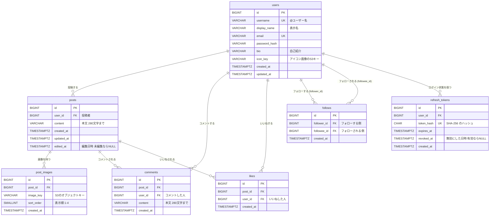

# データ構造・ER図

[要件定義書](./requirements.md) の詳細ドキュメント。X風SNSアプリのデータ構造・データベース設計をまとめる。

DBエンジンは PostgreSQL 17、スキーマ管理は Flyway で行う（[技術スタック](./tech-stack.md)参照）。実装後は、以下のテーブル定義を実際のマイグレーション（`backend/src/main/resources/db/migration/`）および MyBatis の Mapper（`backend/src/main/resources/mapper/*.xml`）と一致させる。データベースの文字コードは `UTF8`（絵文字もそのまま保存できる）。
`VARCHAR(n)` の `n` はバイト数ではなく文字数なので、日本語でも「280文字まで」をそのまま表せる。

## ER図



### リレーションのまとめ

| 関係 | 種類 | 説明 |
|---|---|---|
| users – posts | 1 対 多 | 1人のユーザーはたくさん投稿できる |
| posts – post_images | 1 対 多（最大4） | 1つの投稿に画像は0〜4枚 |
| users – posts（comments 経由） | 多 対 多 | 誰でも、どの投稿にも、何回でもコメントできる |
| users – posts（likes 経由） | 多 対 多 | 誰でも、どの投稿にもいいねできる。ただし同じ組み合わせは1回だけ |
| users – users（follows 経由） | 多 対 多（自己参照） | ユーザー同士がフォローし合う。同じテーブルを2回参照する |
| users – refresh_tokens | 1 対 多 | ログインした端末（ブラウザ）ごと、再発行のたびに1行増える。古いものは無効（revoked_at あり）として残る |

## テーブル定義

共通ルール

- 主キーはすべて `id BIGINT GENERATED ALWAYS AS IDENTITY`（表では「IDENTITY」と略す）。MyBatis では `<insert useGeneratedKeys="true" keyProperty="id">` で採番された ID を受け取る
- 日時の列はすべて `TIMESTAMPTZ`（`TIMESTAMP WITH TIME ZONE`）。タイムゾーンつきで保存するので、サーバーの設定が変わっても日時がずれない
- `created_at` / `updated_at` はアプリ側（サービスで現在時刻を入れて INSERT・UPDATE する）で設定する。PostgreSQL には MySQL の `ON UPDATE CURRENT_TIMESTAMP` のような機能がないため
- 論理削除はしない（削除は物理削除）

### users（ユーザー）

| カラム | 型 | NULL | 制約・初期値 | 説明 |
|---|---|---|---|---|
| id | BIGINT | × | PK, IDENTITY | |
| username | VARCHAR(15) | × | UNIQUE(LOWER(username)) | `@` の後ろの名前。半角英数字と `_`。変更不可。大文字・小文字を区別せずに重複を防ぐため、`LOWER(username)` に一意インデックスを張る |
| display_name | VARCHAR(50) | × | | 表示名 |
| email | VARCHAR(255) | × | UNIQUE | ログインに使う。アプリ側で小文字にそろえてから保存する |
| password_hash | VARCHAR(255) | × | | BCrypt でハッシュ化したパスワード |
| bio | VARCHAR(160) | ○ | | 自己紹介 |
| icon_key | VARCHAR(255) | ○ | | アイコン画像の S3 オブジェクトキー（例: `icons/uuid.png`）。NULL ならデフォルト画像 |
| created_at | TIMESTAMPTZ | × | | 登録日時 |
| updated_at | TIMESTAMPTZ | × | | 更新日時 |

### posts（投稿）

| カラム | 型 | NULL | 制約・初期値 | 説明 |
|---|---|---|---|---|
| id | BIGINT | × | PK, IDENTITY | |
| user_id | BIGINT | × | FK → users.id, ON DELETE CASCADE | 投稿者 |
| content | VARCHAR(280) | × | 初期値 `''` | 本文。画像つき投稿なら空文字も可 |
| created_at | TIMESTAMPTZ | × | | 投稿日時 |
| updated_at | TIMESTAMPTZ | × | | 更新日時 |
| edited_at | TIMESTAMPTZ | ○ | | ユーザーが本文を編集した日時。NULL なら未編集。「編集済み」表示に使う |

> `updated_at` だけで「編集済み」を判定しないのは、将来システム側の都合で行を更新したときにも「編集済み」になってしまうのを防ぐため。

### post_images（投稿画像）

| カラム | 型 | NULL | 制約・初期値 | 説明 |
|---|---|---|---|---|
| id | BIGINT | × | PK, IDENTITY | |
| post_id | BIGINT | × | FK → posts.id, ON DELETE CASCADE | どの投稿の画像か |
| image_key | VARCHAR(255) | × | | S3 のオブジェクトキー（例: `posts/2026/09/uuid.jpg`） |
| sort_order | SMALLINT | × | CHECK(sort_order BETWEEN 1 AND 4) | 表示順 |
| created_at | TIMESTAMPTZ | × | | |

- UNIQUE(post_id, sort_order)
- 画像ファイルそのものは DB に入れず S3 に保存し、DB にはオブジェクトキーだけを持つ。URL（`https://...`）ごと保存しないのは、配信元（CloudFront のドメインや LocalStack）が変わっても DB を書き換えずに済むようにするため
- ファイル名はアップロード時の名前を使わず UUID にする（同じ名前の衝突と、ファイル名に含まれる個人情報を避けるため）

### comments（コメント）

| カラム | 型 | NULL | 制約・初期値 | 説明 |
|---|---|---|---|---|
| id | BIGINT | × | PK, IDENTITY | |
| post_id | BIGINT | × | FK → posts.id, ON DELETE CASCADE | コメント先の投稿 |
| user_id | BIGINT | × | FK → users.id, ON DELETE CASCADE | コメントした人 |
| content | VARCHAR(280) | × | | 本文 |
| created_at | TIMESTAMPTZ | × | | コメント日時 |

- コメントは編集できないので `updated_at` は持たない

### likes（いいね）

| カラム | 型 | NULL | 制約・初期値 | 説明 |
|---|---|---|---|---|
| id | BIGINT | × | PK, IDENTITY | |
| post_id | BIGINT | × | FK → posts.id, ON DELETE CASCADE | いいねされた投稿 |
| user_id | BIGINT | × | FK → users.id, ON DELETE CASCADE | いいねした人 |
| created_at | TIMESTAMPTZ | × | | いいねした日時 |

- **UNIQUE(post_id, user_id)**: 同じ人が同じ投稿に2回いいねできないように、DB で止める。
  ボタンの連打などで同時にリクエストが来ても、アプリ側のチェックだけでは重複を防ぎきれないため
- いいねの取り消しは、行を削除する
- いいね済みの投稿にもう一度いいねのリクエストが来てもエラーにしないように、PostgreSQL の `ON CONFLICT DO NOTHING` を使う（フォローも同じ）

```sql
INSERT INTO likes (post_id, user_id, created_at)
VALUES (:postId, :me, now())
ON CONFLICT (post_id, user_id) DO NOTHING;
```

### follows（フォロー）

| カラム | 型 | NULL | 制約・初期値 | 説明 |
|---|---|---|---|---|
| id | BIGINT | × | PK, IDENTITY | |
| follower_id | BIGINT | × | FK → users.id, ON DELETE CASCADE | フォローする側（自分） |
| followee_id | BIGINT | × | FK → users.id, ON DELETE CASCADE | フォローされる側（相手） |
| created_at | TIMESTAMPTZ | × | | フォローした日時 |

- **UNIQUE(follower_id, followee_id)**: 同じ相手を2回フォローできない
- **CHECK(follower_id <> followee_id)**: 自分自身はフォローできない（エラーメッセージをわかりやすくするため、アプリ側でもチェックする）
- 「Aさんのフォロワー」= `followee_id = A` の行、「Aさんがフォロー中」= `follower_id = A` の行

### refresh_tokens（リフレッシュトークン）

ログイン状態を保つためのリフレッシュトークン（[機能定義書：認証](./feature-specs/01_auth.md)）。

| カラム | 型 | NULL | 制約・初期値 | 説明 |
|---|---|---|---|---|
| id | BIGINT | × | PK, IDENTITY | |
| user_id | BIGINT | × | FK → users.id, ON DELETE CASCADE | トークンの持ち主 |
| token_hash | CHAR(64) | × | UNIQUE | トークンの SHA-256 ハッシュ（16進数64文字）。トークンそのものは保存しない |
| expires_at | TIMESTAMPTZ | × | | 有効期限（発行から14日） |
| revoked_at | TIMESTAMPTZ | ○ | | 無効にした日時（再発行で使用済みになった、ログアウトした、使い回しを検知した）。NULL なら有効 |
| created_at | TIMESTAMPTZ | × | | 発行日時 |

- トークンそのものではなくハッシュを保存するのは、DB の中身が漏れてもトークンとして使えないようにするため（パスワードを BCrypt で保存するのと同じ考え方。トークンは十分に長いランダムな値なので、高速な SHA-256 でよい）
- 無効にした行も、使い回しの検知のために残しておく。期限切れの行は今後まとめて削除する（今回は未対応）

## インデックス

PostgreSQL では、UNIQUE 制約には自動でインデックスが作られるが、**外部キーの列には自動で作られない**（MySQL とは違う点）。
そのため、外部キーの列にも明示的にインデックスを作る。

| テーブル | インデックス | 使う場面 |
|---|---|---|
| posts | (user_id, created_at DESC) | フォロー中タイムライン・プロフィールの投稿一覧（ユーザーで絞って新しい順） |
| posts | (created_at DESC, id DESC) | 全体タイムライン（絞り込みなしで新しい順） |
| comments | (post_id, created_at) | 投稿詳細のコメント一覧、コメント数の集計 |
| comments | (user_id) | ユーザー削除時の CASCADE |
| likes | UNIQUE(post_id, user_id) | いいね数の集計、自分がいいね済みかの判定（先頭の post_id で集計にも使える） |
| likes | (user_id) | ユーザー削除時の CASCADE |
| follows | UNIQUE(follower_id, followee_id) | タイムライン取得時の「自分がフォロー中の人」の検索、フォロー中一覧 |
| follows | (followee_id) | フォロワー一覧、フォロワー数の集計 |
| post_images | UNIQUE(post_id, sort_order) | 投稿の画像取得 |
| refresh_tokens | UNIQUE(token_hash) | 再発行・ログアウトでトークンを探す |
| refresh_tokens | (user_id) | 使い回しを検知したときに、そのユーザーのトークンをまとめて無効にする。ユーザー削除時の CASCADE |
| users | UNIQUE(LOWER(username)) | ユーザー名の重複チェック（大文字・小文字を区別しない）、プロフィール表示 |
| users | (created_at DESC) | ユーザー検索でキーワードが空のときの「最近参加したユーザー」 |
| users | GIN(username gin_trgm_ops)<br>GIN(display_name gin_trgm_ops) | ユーザー検索の部分一致（`ILIKE '%キーワード%'`） |

### ユーザー検索のインデックスについて

- 部分一致（`'%yama%'` のように前に `%` が付く検索）は、普通のインデックス（B-tree）が使えない
- PostgreSQL の拡張機能 **pg_trgm**（文字を3文字ずつに分けて索引を作る仕組み）を使うと、部分一致でもインデックスが効く
- 利用には `CREATE EXTENSION IF NOT EXISTS pg_trgm;` が必要
- 学習用の規模（数百ユーザー）ではインデックスがなくても十分速いので、**最初は作らず、ユーザーが増えてから追加してもよい**

```sql
CREATE EXTENSION IF NOT EXISTS pg_trgm;
CREATE INDEX idx_users_username_trgm     ON users USING GIN (username gin_trgm_ops);
CREATE INDEX idx_users_display_name_trgm ON users USING GIN (display_name gin_trgm_ops);
```

## いいね数・コメント数の出し方

### 採用する方法: 毎回 COUNT で集計する

`posts` テーブルに「いいね数」の列は持たず、表示のたびに `likes` と `comments` の行数を数える。

- メリット: 数がずれることがない。いいね・コメントの追加/削除のときに、別のテーブルを更新する必要がない
- デメリット: データが非常に多くなると集計が重くなる（学習用の規模なら問題ない）

フォロー中タイムライン取得のイメージ（ログイン中のユーザー ID を `:me` とする）:

```sql
SELECT
    p.id, p.content, p.created_at, p.edited_at,
    u.username, u.display_name, u.icon_key,
    (SELECT COUNT(*) FROM likes    l WHERE l.post_id = p.id)                  AS like_count,
    (SELECT COUNT(*) FROM comments c WHERE c.post_id = p.id)                  AS comment_count,
    EXISTS (SELECT 1 FROM likes l2 WHERE l2.post_id = p.id AND l2.user_id = :me) AS liked_by_me
FROM posts p
JOIN users u ON u.id = p.user_id
WHERE p.user_id = :me
   OR p.user_id IN (SELECT f.followee_id FROM follows f WHERE f.follower_id = :me)
ORDER BY p.created_at DESC, p.id DESC
LIMIT 20 OFFSET :offset;
```

全体タイムラインは、上の SQL から `WHERE` 句を外すだけで取得できる（いいね数・コメント数・`liked_by_me` の出し方は同じ）。

- 投稿1件ごとに別の SQL を発行する書き方（N+1問題）にならないよう、1回の SQL でまとめて取る
- 画像は、取得した20件の投稿 ID でまとめて `post_images` を1回だけ取得する
- `ORDER BY` に `p.id` も入れるのは、同じ日時の投稿があっても順番が毎回同じになるようにするため
- PostgreSQL では `EXISTS (...)` の結果が `boolean` 型で返るので、`liked_by_me` をそのまま Java の `boolean` に入れられる。`COUNT(*)` は `bigint` 型なので、Java では `long` で受け取る

### ユーザー検索の SQL

キーワードを `:q` とする。`:q` は前後の空白と先頭の `@` を取り除き、`%` `_` `\` を `\` でエスケープしたもの（エスケープしないと、`_` が「任意の1文字」として扱われてしまう）。

```sql
SELECT
    u.id, u.username, u.display_name, u.bio, u.icon_key,
    EXISTS (SELECT 1 FROM follows f
            WHERE f.follower_id = :me AND f.followee_id = u.id) AS followed_by_me
FROM users u
WHERE u.username     ILIKE '%' || :q || '%'
   OR u.display_name ILIKE '%' || :q || '%'
ORDER BY
    CASE
        WHEN LOWER(u.username) = LOWER(:q)          THEN 0  -- ユーザー名が完全一致
        WHEN u.username ILIKE :q || '%'             THEN 1  -- ユーザー名が前方一致
        ELSE 2                                              -- それ以外
    END,
    u.username
LIMIT 20 OFFSET :offset;
```

- `ILIKE` は PostgreSQL の、大文字・小文字を区別しない `LIKE`
- キーワードが空のときは `WHERE` を外し、`ORDER BY u.created_at DESC, u.id DESC` にする（最近参加したユーザー）

### 将来の改善案: カウンタ列を持つ

投稿やいいねが大量になったら、`posts` に `like_count` / `comment_count` 列を追加し、いいね・コメントの追加/削除と同じトランザクションで `+1` / `-1` する方法に切り替える。
読み込みは速くなるが、更新漏れで数がずれないように気をつける必要がある。今回は採用しない。

## 参照整合性・カスケード削除について

- すべての外部キーに `ON DELETE CASCADE` を指定する（前回のタスク管理アプリの V1 では指定していなかったが、今回は投稿削除で子レコード（画像・コメント・いいね）を必ず消す仕様のため、DB 制約で保証する）

| 削除するもの | 一緒に消えるもの |
|---|---|
| 投稿 | その投稿の画像（post_images）、コメント、いいね |
| ユーザー（今回は画面なし） | そのユーザーの投稿（とそこにぶら下がるもの全部）、コメント、いいね、フォロー関係、リフレッシュトークン |

- DB の行は `ON DELETE CASCADE` で消える。S3 上の画像ファイルは DB では消えないので、アプリ側で S3 から削除する
- S3 の削除は、DB のトランザクションがコミットされた後に行う（先に S3 を消して DB の削除が失敗すると、投稿は残るのに画像だけ消えてしまうため）。S3 の削除に失敗しても、ログに残すだけでエラーにはしない

## マイグレーション管理

- Flyway でスキーマを管理し、`backend/src/main/resources/db/migration/` 配下に `V<番号>__<説明>.sql` の形式で配置する（前回と同じ）
- テーブルは、それを使う機能を実装するときに1つずつマイグレーションを追加する（全テーブルを最初にまとめて作らない）

| ファイル | 内容 | 状態 |
|---|---|---|
| `V1__create_users.sql` | users テーブルの作成（ユーザー名の大文字小文字を区別しない一意インデックス、ユーザー名の形式・メールの小文字の CHECK 制約、登録日時のインデックス） | 作成済み（ユーザー登録・ログイン） |
| `V2__create_refresh_tokens.sql` | refresh_tokens テーブルの作成（トークンのハッシュの一意制約、user_id のインデックス） | 作成済み（アクセストークン＋リフレッシュトークン方式） |
| `V3__create_posts.sql` | posts テーブルの作成（ユーザー別・全体のタイムライン用のインデックス） | 作成済み（投稿・タイムライン） |
| `V4__create_follows.sql` | follows テーブルの作成（一意制約・自分自身をフォローできない CHECK 制約、followee_id のインデックス）。フォロー中タイムラインで使うため、フォローの画面より先に作成 | 作成済み（投稿・タイムライン） |
| `V5__`〜 | post_images・comments・likes テーブル | 各機能の実装時に追加 |
| （未定） | ローカル動作確認用のサンプルデータ（複数ユーザー、投稿、コメント、いいね、フォロー関係） | 投稿・タイムラインの実装時に追加 |

- pg_trgm 拡張とユーザー検索用の GIN インデックスは、必要になった時点で `V<次の番号>__add_user_search_index.sql` として追加する
- `bootRun` 起動時に Flyway が未適用のマイグレーションを自動実行する（[技術スタック](./tech-stack.md)参照）
- 一度適用したマイグレーションファイルは書き換えず、変更は新しい番号のファイルで行う
