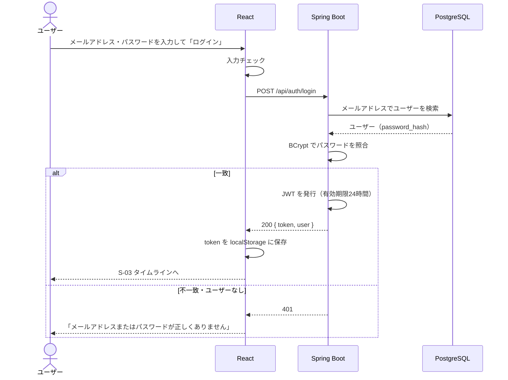
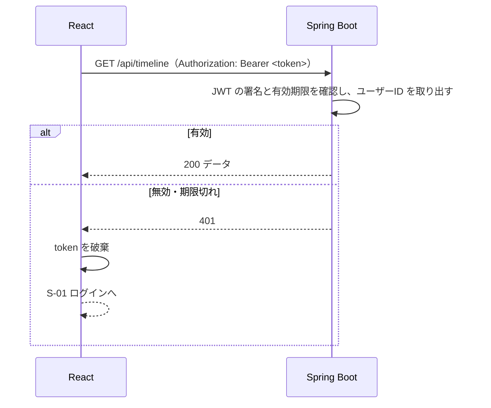

# 機能定義書：認証

## 1. 概要

アカウントを作り、ログインして、アプリを使える状態にする。ログイン状態は JWT（トークン）で管理する。

| ID | 機能名 |
|---|---|
| F-01 | 新規登録 |
| F-02 | ログイン |
| F-03 | ログアウト |
| F-04 | ログインユーザー情報の取得 |

## 2. 前提条件・権限

| 機能 | 前提 |
|---|---|
| 新規登録・ログイン | 未ログインであること（ログイン済みで S-01 / S-02 を開いたら S-03 へ移動する） |
| ログアウト・ログインユーザー情報の取得 | ログイン済みであること |

## 3. 画面

| 画面 | 動き |
|---|---|
| S-01 ログイン | 成功したら S-03 タイムライン（フォロー中）へ。失敗したらフォームの上にエラーを表示し、パスワード欄だけを空にする |
| S-02 新規登録 | 成功したらそのままログイン状態にして S-03 へ。項目ごとのエラーは各入力欄の下に表示する |
| 共通ヘッダー | 「ログアウト」を押すと確認なしでログアウトし、S-01 へ |
| アプリを開いたとき | トークンがあれば F-04 でユーザー情報を取得する。取得中は画面全体にローディングを出す。失敗（401）ならトークンを破棄して S-01 へ |

- 送信ボタンは、送信中は押せないようにする（二重送信を防ぐ）

## 4. 入力項目とチェック

### 新規登録（F-01）

| 項目 | 必須 | チェック | エラーメッセージ |
|---|---|---|---|
| ユーザー名 | ○ | 半角英数字と `_`、4〜15文字 | 「ユーザー名は半角英数字と_で4〜15文字で入力してください」 |
| | | 大文字・小文字を区別せずに重複していないこと（サーバーでチェック） | 「このユーザー名はすでに使われています」 |
| 表示名 | ○ | 1〜50文字（前後の空白は取り除いてから数える） | 「表示名は1〜50文字で入力してください」 |
| メールアドレス | ○ | メール形式、255文字以内 | 「メールアドレスの形式が正しくありません」 |
| | | 重複していないこと（サーバーでチェック） | 「このメールアドレスはすでに登録されています」 |
| パスワード | ○ | 8〜72文字 | 「パスワードは8文字以上で入力してください」 |
| パスワード（確認） | ○ | パスワードと一致（フロントのみ） | 「パスワードが一致しません」 |

- パスワードの上限を72文字にするのは、BCrypt が72バイトまでしか扱えないため
- メールアドレスは小文字にそろえて保存する（`Yamada@Example.com` と `yamada@example.com` を同じとみなす）

### ログイン（F-02）

| 項目 | 必須 | チェック |
|---|---|---|
| メールアドレス | ○ | メール形式 |
| パスワード | ○ | 空でないこと |

## 5. 処理の流れ

### 新規登録・ログイン

新規登録は、「ユーザーを検索して照合」の代わりに「重複チェック → パスワードをハッシュ化 → users に INSERT」を行い、その後は同じく JWT を発行して返す。

### ログイン後の API 呼び出し

## 6. 業務ルール

| ルール | 内容 |
|---|---|
| トークンの有効期限 | 24時間。期限が切れたら再ログインしてもらう（リフレッシュトークンは今回は作らない） |
| トークンの中身 | ユーザーID と有効期限だけを入れる。メールアドレスなどの個人情報は入れない |
| トークンの保存場所 | ブラウザの localStorage |
| ログアウト | サーバーには何も送らず、localStorage のトークンを削除するだけ。（発行済みのトークンは期限まで有効なまま、という制限がある） |
| ログイン失敗時のメッセージ | メールアドレスとパスワードのどちらが違うかは教えない（登録済みのメールアドレスを探られないようにするため） |
| パスワードの保存 | BCrypt でハッシュ化する。平文やログには絶対に出さない |

## 7. API

| ID | メソッド | パス | 備考 |
|---|---|---|---|
| A-01 | POST | `/api/auth/signup` | 201。レスポンスは A-02 と同じ `{ token, user }` |
| A-02 | POST | `/api/auth/login` | 200 |
| A-03 | GET | `/api/auth/me` | 200。`{ id, username, displayName, iconUrl }` |

`/api/auth/signup`・`/api/auth/login`・`/api/health` 以外の API は、すべてトークンが必要。

## 8. 使うテーブル

| テーブル | 新規登録 | ログイン | ユーザー情報の取得 |
|---|---|---|---|
| users | R（重複チェック）・C | R | R |

## 9. エラー・例外時の動き

| 状況 | ステータス | 画面の表示 |
|---|---|---|
| 入力チェックエラー | 400 | 各入力欄の下にメッセージ |
| ユーザー名が使われている | 409 | ユーザー名の欄の下に「このユーザー名はすでに使われています」 |
| メールアドレスが登録済み | 409 | メールアドレスの欄の下に「このメールアドレスはすでに登録されています」 |
| ログイン失敗 | 401 | フォームの上に「メールアドレスまたはパスワードが正しくありません」 |
| 同時に同じユーザー名で登録された | 409 | 上と同じ。DB の一意制約違反をつかまえて 409 にする |

## 10. 受け入れ条件

- [ ] 正しい内容で新規登録すると、ログイン状態で S-03 に移動する
- [ ] 登録済みのユーザー名（大文字・小文字だけ違うものも含む）では登録できない
- [ ] 登録済みのメールアドレスでは登録できない
- [ ] DB の `password_hash` に平文のパスワードが入っていない
- [ ] 正しいメールアドレスとパスワードでログインできる
- [ ] メールアドレスかパスワードが違うと、同じメッセージでログインに失敗する
- [ ] ログイン後にリロードしても、ログイン状態が続く
- [ ] ログアウトすると S-01 に移動し、ブラウザの「戻る」でログイン後の画面に戻れない
- [ ] トークンなし・期限切れのトークンで API を呼ぶと 401 になり、S-01 に移動する
- [ ] ログイン済みで `/login` を開くと S-03 に移動する
