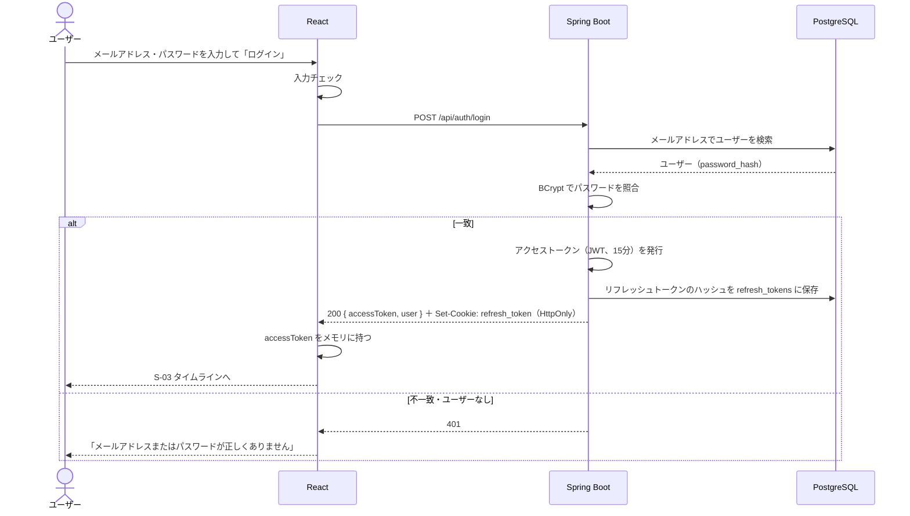
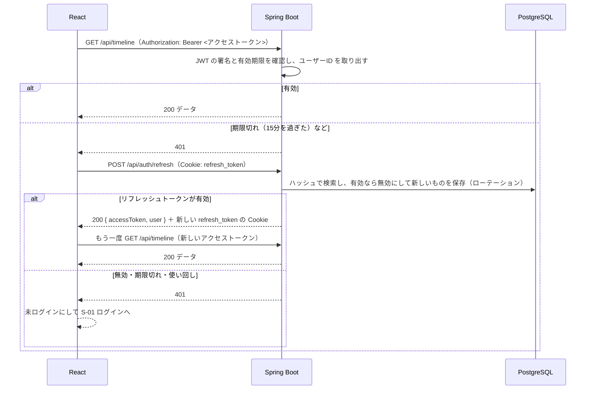

# 機能定義書：認証

## 1. 概要

アカウントを作り、ログインして、アプリを使える状態にする。ログイン状態は **アクセストークン（JWT、15分）＋リフレッシュトークン（14日）** の2つで管理する。

| ID | 機能名 |
|---|---|
| F-01 | 新規登録 |
| F-02 | ログイン |
| F-03 | ログアウト |
| F-04 | ログインユーザー情報の取得 |

## 2. 前提条件・権限

| 機能 | 前提 |
|---|---|
| 新規登録・ログイン | 未ログインであること（ログイン済みで S-01 / S-02 を開いたら S-03 へ移動する） |
| ログアウト・ログインユーザー情報の取得 | ログイン済みであること（ログアウトはリフレッシュトークンの Cookie で行うので、アクセストークンの期限が切れていてもできる） |

## 3. 画面

| 画面 | 動き |
|---|---|
| S-01 ログイン | 成功したら S-03 タイムライン（フォロー中）へ。失敗したらフォームの上にエラーを表示し、パスワード欄だけを空にする |
| S-02 新規登録 | 成功したらそのままログイン状態にして S-03 へ。項目ごとのエラーは各入力欄の下に表示する |
| 共通ヘッダー | 「ログアウト」を押すと確認なしでログアウトし、S-01 へ |
| アプリを開いたとき | リフレッシュトークン（Cookie）でアクセストークンを再発行（A-04）し、そのレスポンスのユーザー情報でログイン状態を復元する。取得中は画面全体にローディングを出す。失敗（401）なら未ログインとして S-01 へ |

- 送信ボタンは、送信中は押せないようにする（二重送信を防ぐ）

## 4. 入力項目とチェック

### 新規登録（F-01）

| 項目 | 必須 | チェック | エラーメッセージ |
|---|---|---|---|
| ユーザー名 | ○ | 半角英数字と `_`、4〜15文字 | 「ユーザー名は半角英数字と_で4〜15文字で入力してください」 |
| | | 大文字・小文字を区別せずに重複していないこと（サーバーでチェック） | 「このユーザー名はすでに使われています」 |
| 表示名 | ○ | 1〜50文字（前後の空白は取り除いてから数える） | 「表示名は1〜50文字で入力してください」 |
| メールアドレス | ○ | メール形式、255文字以内 | 「メールアドレスの形式が正しくありません」 |
| | | 重複していないこと（サーバーでチェック） | 「このメールアドレスはすでに登録されています」 |
| パスワード | ○ | 8〜72文字 | 「パスワードは8文字以上で入力してください」 |
| パスワード（確認） | ○ | 空でないこと（フロントのみ） | 「パスワード（確認）を入力してください」 |
| | | パスワードと一致（フロントのみ） | 「パスワードが一致しません」 |

- パスワードの上限を72文字にするのは、BCrypt が72バイトまでしか扱えないため
- メールアドレスは小文字にそろえて保存する（`Yamada@Example.com` と `yamada@example.com` を同じとみなす）

### ログイン（F-02）

| 項目 | 必須 | チェック |
|---|---|---|
| メールアドレス | ○ | メール形式 |
| パスワード | ○ | 空でないこと |

## 5. 処理の流れ

### 2つのトークン

| トークン | 中身・形式 | 有効期限 | 画面側での持ち方 | 使う場面 |
|---|---|---|---|---|
| アクセストークン | JWT（ユーザーIDと有効期限だけ） | 15分 | JavaScript の変数（メモリ）にだけ持つ。localStorage には保存しない | ログインが必要な API に `Authorization: Bearer <token>` で付ける |
| リフレッシュトークン | 推測できないランダムな文字列（256ビット） | 14日 | サーバーが HttpOnly Cookie で渡す。JavaScript からは読めない | アクセストークンの再発行（A-04）とログアウト（A-05）。Cookie は `/api/auth` の下にだけ送られる |

アクセストークンを短くし、localStorage に置かないことで、盗まれたときの被害を小さくする。ページを開き直すとメモリのアクセストークンは消えるが、リフレッシュトークンで再発行するのでログイン状態は続く。

### 新規登録・ログイン

新規登録は、「ユーザーを検索して照合」の代わりに「重複チェック → パスワードをハッシュ化 → users に INSERT」を行い、その後は同じく2つのトークンを発行して返す。

### ログイン後の API 呼び出しと、アクセストークンの再発行

- 同時に複数の API が 401 になっても、再発行の呼び出しは1回にまとめる（リフレッシュトークンは一度しか使えないため）
- 再発行してやり直すのは1回だけ。やり直しても 401 なら未ログインにする

### ログアウト

`POST /api/auth/logout`（Cookie: refresh_token）で、サーバー側のリフレッシュトークンを無効にし、Cookie を消す。画面側はメモリのアクセストークンを捨てて S-01 へ移動する。

## 6. 業務ルール

| ルール | 内容 |
|---|---|
| アクセストークンの有効期限 | 15分。切れたらリフレッシュトークンで自動的に再発行する（ユーザーは気づかない） |
| リフレッシュトークンの有効期限 | 14日。最後に再発行してから14日たつと、もう一度ログインが必要 |
| トークンの中身 | アクセストークンにはユーザーID と有効期限だけを入れる。メールアドレスなどの個人情報は入れない |
| トークンの保存場所 | アクセストークンはメモリ（JavaScript の変数）。リフレッシュトークンは HttpOnly・SameSite=Strict・Path=/api/auth の Cookie（本番は Secure も付ける）。どちらも localStorage には保存しない |
| リフレッシュトークンの保存（サーバー） | トークンそのものは保存せず、SHA-256 のハッシュだけを refresh_tokens に保存する |
| ローテーション | 再発行のたびに、使ったリフレッシュトークンを無効にして新しいものを渡す |
| 使い回しの検知 | 無効になったリフレッシュトークンがもう一度使われたら、盗まれた可能性があるので、そのユーザーのリフレッシュトークンをすべて無効にする（そのユーザーはすべての端末でもう一度ログインが必要） |
| ログアウト | サーバーでリフレッシュトークンを無効にする。発行済みのアクセストークンは、期限（最長15分）が切れるまでは有効なまま |
| ログイン失敗時のメッセージ | メールアドレスとパスワードのどちらが違うかは教えない（登録済みのメールアドレスを探られないようにするため） |
| パスワードの保存 | BCrypt でハッシュ化する。平文やログには絶対に出さない |

## 7. API

| ID | メソッド | パス | 認証 | 備考 |
|---|---|---|---|---|
| A-01 | POST | `/api/auth/signup` | 不要 | 201。`{ accessToken, user }` ＋ リフレッシュトークンの Cookie |
| A-02 | POST | `/api/auth/login` | 不要 | 200。A-01 と同じ形 |
| A-03 | GET | `/api/auth/me` | アクセストークン | 200。`{ id, username, displayName, iconUrl }` |
| A-04 | POST | `/api/auth/refresh` | リフレッシュトークン（Cookie） | 200。A-01 と同じ形。リフレッシュトークンも新しいものに交換する |
| A-05 | POST | `/api/auth/logout` | リフレッシュトークン（Cookie） | 204。リフレッシュトークンを無効にし、Cookie を消す。Cookie がなくても 204 |

`/api/auth/signup`・`/api/auth/login`・`/api/auth/refresh`・`/api/auth/logout`・`/api/health` 以外の API は、すべてアクセストークンが必要。

## 8. 使うテーブル

| テーブル | 新規登録 | ログイン | 再発行 | ログアウト | ユーザー情報の取得 |
|---|---|---|---|---|---|
| users | R（重複チェック）・C | R | R | | R |
| refresh_tokens | C | C | R・U（無効化）・C | R・U（無効化） | |

## 9. エラー・例外時の動き

| 状況 | ステータス | 画面の表示 |
|---|---|---|
| 入力チェックエラー | 400 | 各入力欄の下にメッセージ |
| ユーザー名が使われている | 409 | ユーザー名の欄の下に「このユーザー名はすでに使われています」 |
| メールアドレスが登録済み | 409 | メールアドレスの欄の下に「このメールアドレスはすでに登録されています」 |
| ログイン失敗 | 401 | フォームの上に「メールアドレスまたはパスワードが正しくありません」 |
| 同時に同じユーザー名で登録された | 409 | 上と同じ。DB の一意制約違反をつかまえて 409 にする |
| アクセストークンの期限切れ | 401 | 画面には出さない。自動で再発行してやり直す |
| リフレッシュトークンがない・無効・期限切れ・使い回し | 401（「ログインの有効期限が切れました。もう一度ログインしてください」） | S-01 ログインへ |

## 10. 受け入れ条件

- [ ] 正しい内容で新規登録すると、ログイン状態で S-03 に移動する
- [ ] 登録済みのユーザー名（大文字・小文字だけ違うものも含む）では登録できない
- [ ] 登録済みのメールアドレスでは登録できない
- [ ] DB の `password_hash` に平文のパスワードが入っていない
- [ ] 正しいメールアドレスとパスワードでログインできる
- [ ] メールアドレスかパスワードが違うと、同じメッセージでログインに失敗する
- [ ] リフレッシュトークンは HttpOnly の Cookie で届き、JavaScript から読めない。アクセストークンは localStorage に保存されない
- [ ] DB の `refresh_tokens` にはトークンそのものではなくハッシュが入っている
- [ ] ログイン後にリロードしても、ログイン状態が続く（リフレッシュトークンで再発行される）
- [ ] アクセストークンの期限が切れたあとに API を呼んでも、自動で再発行されて成功する
- [ ] 再発行のたびにリフレッシュトークンが新しいものに変わり、使用済みのものをもう一度使うと 401 になり、そのユーザーのリフレッシュトークンがすべて無効になる
- [ ] ログアウトすると S-01 に移動し、ブラウザの「戻る」でログイン後の画面に戻れない。ログアウト後は再発行できない
- [ ] トークンなし・期限切れのアクセストークンで API を呼ぶと 401 になる。リフレッシュトークンも無効なら S-01 に移動する
- [ ] ログイン済みで `/login` を開くと S-03 に移動する
