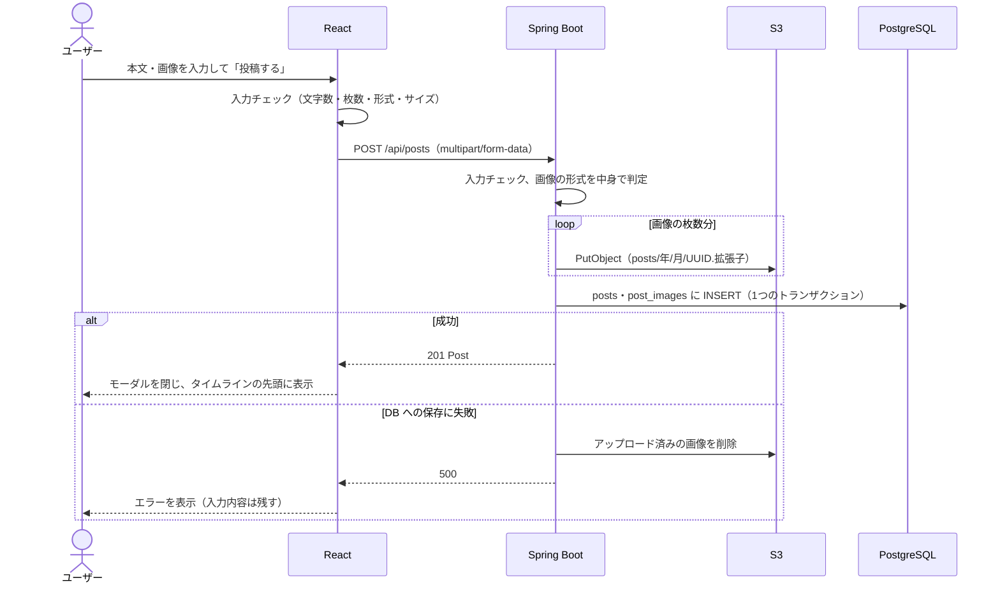
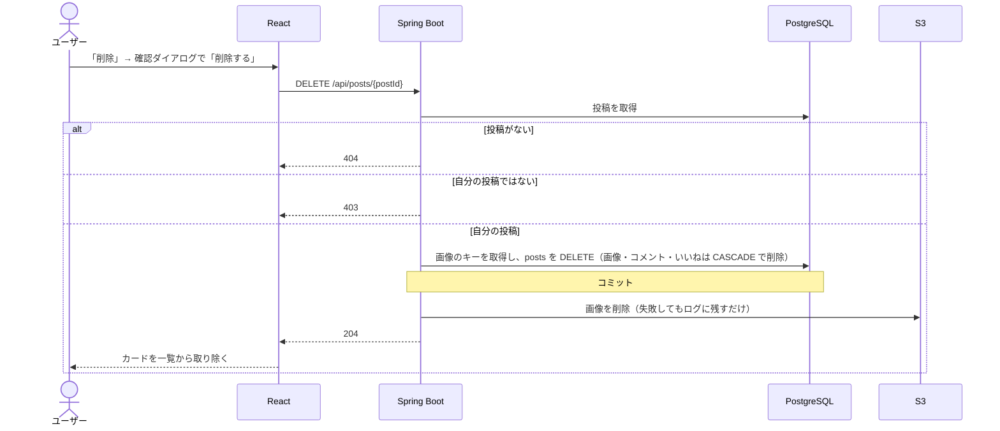

# 機能定義書：投稿

> **実装状況：** 投稿の作成・編集・削除・詳細表示と画像の添付（4枚まで、S3）は実装済み。投稿カードの画像は枚数に応じて並べ（2〜4枚は 16:9 の枠を埋める）、押すと拡大表示（Esc・外側のクリックで閉じる、矢印キー・‹ › で前後に移動）する。

## 1. 概要

テキスト（280文字まで）と画像（4枚まで）を投稿し、自分の投稿を編集・削除できるようにする。画像は S3 に保存する。

| ID | 機能名 |
|---|---|
| F-10 | 投稿作成 |
| F-11 | 投稿編集 |
| F-12 | 投稿削除 |
| F-13 | 投稿詳細表示 |

## 2. 前提条件・権限

| 機能 | 誰ができるか |
|---|---|
| 投稿作成・投稿詳細表示 | ログインユーザー全員 |
| 投稿編集・投稿削除 | **投稿した本人だけ**。サーバー側で必ず確認する |

## 3. 画面

| 画面 | 動き |
|---|---|
| S-03 など「✏ 投稿する」 | S-04 投稿作成モーダルを開く |
| S-04 投稿作成 | 投稿に成功したらモーダルを閉じ、表示中のタイムラインの先頭に新しい投稿を追加する。失敗したらモーダルを開いたままエラーを表示し、入力内容は残す |
| 投稿カードの `…` メニュー | 自分の投稿にだけ表示（API の `mine` が `true`）。「編集」「削除」を選べる |
| S-05 投稿編集 | 保存に成功したらモーダルを閉じ、元の投稿カードの本文を差し替えて「編集済み」を付ける |
| 削除 | 「この投稿を削除しますか？この操作は取り消せません」と確認してから削除する。成功したら、一覧からそのカードを取り除く。S-06 投稿詳細で削除した場合は S-03 へ移動する |
| S-06 投稿詳細 | 投稿カードとコメント（[コメント機能定義書](04_comment.md)）を表示する |

- モーダルに入力中に閉じようとしたら「入力中の内容は破棄されます。よろしいですか？」と確認する
- 投稿ボタンは送信中は押せないようにし、「投稿中…」と表示する

## 4. 入力項目とチェック

| 項目 | 必須 | チェック | エラーメッセージ |
|---|---|---|---|
| 本文 | △ | 280文字以内（前後の空白・改行は取り除いてから数える） | 「本文は280文字以内で入力してください」 |
| 画像 | △ | 4枚まで | 「画像は4枚まで添付できます」 |
| | | jpg / png / gif のみ | 「jpg・png・gif の画像を選択してください」 |
| | | 1枚5MBまで | 「5MB以下の画像を選択してください」 |
| （全体） | | 本文と画像のどちらか一方は必要 | 投稿ボタンを押せない状態にする（メッセージは出さない）。API を直接呼んだときは 400「本文を入力するか、画像を選択してください」 |

- 文字数は「見た目の文字数」で数える。絵文字も1文字として数えるよう、フロントでは `[...text].length` を使い、サーバーでは Java の `codePointCount` を使う
- 画像の形式は、ファイル名の拡張子ではなく**ファイルの中身（先頭のバイト）**でサーバー側が判定する（拡張子を偽装したファイルを防ぐため）
- 編集（F-11）で入力できるのは本文だけ。画像があれば、本文を空にしてもよい

## 5. 処理の流れ

### 投稿作成（F-10）

- S3 へのアップロードを DB の保存より先に行うのは、「DB には行があるのに画像ファイルがない」状態を作らないため

### 投稿削除（F-12）

## 6. 業務ルール

| ルール | 内容 |
|---|---|
| 画像の保存先 | S3 の `posts/{年}/{月}/{UUID}.{拡張子}`。元のファイル名は使わない |
| 画像の順番 | 選んだ順に `sort_order` を 1〜4 で付ける |
| 編集済み | 本文を編集したら `edited_at` に現在日時を入れる。本文が変わっていなければ更新しない |
| 編集できる期間 | 制限なし |
| 削除 | 物理削除。画像・コメント・いいねも一緒に消える |
| 投稿日時の表示 | 1時間以内は「◯分前」、24時間以内は「◯時間前」、それより前は「2026/09/30」 |

## 7. API

| ID | メソッド | パス | 備考 |
|---|---|---|---|
| A-11 | POST | `/api/posts` | multipart。201 で Post を返す |
| A-12 | GET | `/api/posts/{postId}` | 200 で Post を返す |
| A-13 | PUT | `/api/posts/{postId}` | `{ content }`。200 で更新後の Post を返す |
| A-14 | DELETE | `/api/posts/{postId}` | 204 |

Post の形は [API設計「共通のデータ形式」](../api.md#共通のデータ形式) を参照。

## 8. 使うテーブル

| テーブル | 作成 | 編集 | 削除 | 詳細表示 |
|---|---|---|---|---|
| posts | C | R・U | R・D | R |
| post_images | C | R | R・D（CASCADE） | R |
| comments | | R（件数） | D（CASCADE） | R（件数） |
| likes | | R（件数） | D（CASCADE） | R（件数・自分がいいね済みか） |
| users | R（投稿者） | R | | R |

S3 は、作成時にアップロード、削除時に削除する。

## 9. エラー・例外時の動き

| 状況 | ステータス | 画面の表示 |
|---|---|---|
| 入力チェックエラー | 400 | モーダル内にメッセージ。入力内容は残す |
| 画像のサイズが大きすぎる（合計が上限を超えた） | 413 | 「画像のサイズが大きすぎます」 |
| 他人の投稿を編集・削除しようとした | 403 | 「この操作は実行できません」 |
| 投稿が存在しない（削除済みなど） | 404 | S-06: 「この投稿は見つかりません」／編集・削除: 「この投稿はすでに削除されています」と出し、カードを一覧から取り除く |
| S3 へのアップロードに失敗 | 500 | 「画像のアップロードに失敗しました」。DB には何も保存しない |

## 10. 受け入れ条件

- [ ] テキストだけ・画像だけ・テキストと画像の両方で投稿できる
- [ ] 本文も画像もないと投稿ボタンを押せない
- [ ] 281文字では投稿できない（絵文字を含めても正しく数えられる）
- [ ] 画像を5枚以上・5MB超・jpg/png/gif 以外は選べない（サーバーでも拒否される）
- [ ] 投稿した画像が S3 に保存され、CloudFront（開発時は LocalStack）の URL で表示される
- [ ] 投稿するとタイムラインの先頭に表示される
- [ ] 自分の投稿にだけ `…` メニューが表示される
- [ ] 本文を編集すると「編集済み」が表示される
- [ ] 他人の投稿の編集・削除 API を直接呼ぶと 403 になる
- [ ] 投稿を削除すると、その投稿のコメント・いいね・画像（DB の行と S3 のファイル）も消える
- [ ] 存在しない投稿の URL を開くと「この投稿は見つかりません」と表示される
