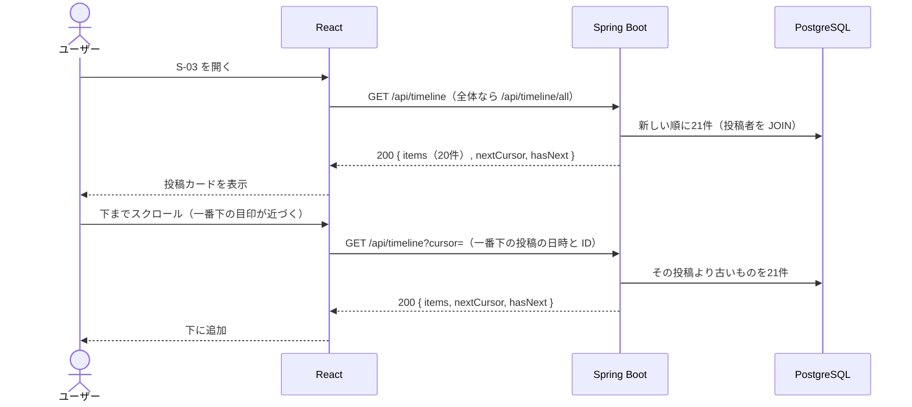
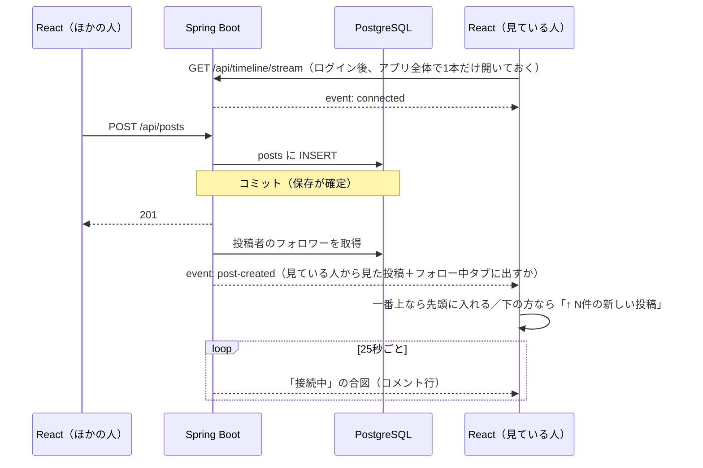

# 機能定義書：タイムライン

> **実装状況：** フォロー中・全体の2つのタブ、無限スクロール（カーソル方式）、リアルタイム反映（SSE）は実装済み。フォローの画面ができるまでは、フォロー中タブには自分の投稿だけが出る（follows テーブルは作成済み）。いいね数・コメント数は各機能の実装時に追加する。

## 1. 概要

投稿を新しい順に一覧表示する。「フォロー中」と「全体」の2種類があり、タブで切り替える。下までスクロールすると続きを自動で読み込み（無限スクロール）、ほかの人の投稿・編集・削除は画面を開いたまま反映する（リアルタイム反映）。各投稿にはいいね数・コメント数を表示する。

| ID | 機能名 |
|---|---|
| F-20 | フォロー中タイムライン表示 |
| F-21 | 追加読み込み（無限スクロール） |
| F-22 | 全体タイムライン表示 |
| F-23 | タイムライン切り替え |
| F-24 | リアルタイム反映 |

## 2. 前提条件・権限

- ログイン済みであること
- 全体タイムラインには全ユーザーの投稿が出る（非公開アカウントの機能はない）

## 3. 画面

S-03 タイムライン（ホーム）。

| タブ | URL | 表示する投稿 |
|---|---|---|
| フォロー中（初期表示） | `/` | 自分 + フォロー中のユーザーの投稿 |
| 全体 | `/all` | 全ユーザーの投稿 |

| 状態 | 表示 |
|---|---|
| 初回の読み込み中 | 「読み込み中…」 |
| 表示中 | 投稿カードを20件。続きがあれば、一番下に近づいたとき（400px 手前）に自動で次の20件を読み込む |
| 続きの読み込み中 | 一番下に「読み込み中…」 |
| 続きがない | 一番下に「これ以上の投稿はありません」 |
| 続きの読み込みに失敗 | 一番下に「読み込みに失敗しました」と「再試行」ボタン。表示済みの投稿は消さない |
| 0件（フォロー中） | 「まだ投稿がありません。『全体』タブで気になる人を探してみましょう」（ユーザー検索の実装後は、検索へのリンクも付ける） |
| 0件（全体） | 「まだ誰も投稿していません。最初の投稿をしてみましょう」 |

- タブを切り替えると URL が変わり、そのタブの最新から読み込み直す
- 投稿カードの中身（いいね・編集・削除など）は各機能定義書を参照

### リアルタイム反映（F-24）

| 届いた通知 | 一番上（80px 以内）を見ているとき | 下の方を読んでいるとき |
|---|---|---|
| 新しい投稿 | すぐ先頭に入れる | 一覧は動かさず、タブの下に「↑ N件の新しい投稿」を出す。押すと先頭に入れて一番上へ移動する |
| 投稿の編集 | 表示中のカードの本文を差し替え、「編集済み」を付ける | 同左 |
| 投稿の削除 | 表示中のカードを消す | 同左（「新しい投稿」にためている分からも消す） |

- フォロー中タブでは、自分とフォロー中の人の投稿だけを出す（通知にサーバーが「フォロー中タブに出すか」を付けて送る）
- 自分の投稿も通知で届く（別のタブで投稿したときなど）。投稿した画面では同じ投稿を二重に表示しない
- 投稿詳細（S-06）を開いている間に、その投稿が編集されたら本文を差し替え、削除されたら「この投稿は削除されました」と表示する

## 4. 入力項目とチェック

| 項目 | チェック |
|---|---|
| `cursor`（クエリパラメータ） | 前回のレスポンスの `nextCursor` をそのまま渡す。省略すると最新から。形式が違えば 400 |

## 5. 処理の流れ

### 一覧と無限スクロール

- 21件取得して21件目があるかで「続きあり」を判定する（件数を数える SQL を別に発行しないため）
- 続きは「一番下の投稿より古いもの」を取る（カーソル方式）。ページ番号（OFFSET）と違い、新しい投稿が先頭に増えても位置がずれないので、重複も抜けも起きない
- SQL の詳細は [データ構造・ER図「いいね数・コメント数の出し方」](../database.md#いいね数コメント数の出し方) を参照

### リアルタイム反映

- 通知は DB への保存が確定してから送る（保存に失敗した投稿を通知しない）
- 送信は別のスレッドで行い、投稿した人のリクエストを待たせない
- 接続が切れたら画面側が自動でつなぎ直す（1秒から始めて、失敗が続くと最大30秒まで間をあける）。60秒間なにも届かなければ（合図も届かなければ）切れているとみなしてつなぎ直す
- つなぎ直したときは、切れていた間の新しい投稿を取りこぼさないよう、最新の20件を取り直して「新しい投稿」として扱う

## 6. 業務ルール

| ルール | 内容 |
|---|---|
| 並び順 | 投稿日時の新しい順。同じ日時なら投稿IDの大きい順 |
| 件数 | 一度に20件 |
| 自分の投稿 | フォロー中タイムラインにも自分の投稿を含める |
| 表示する情報 | 投稿者のアイコン・表示名・ユーザー名、投稿日時、本文、画像、コメント数、いいね数、自分がいいね済みか、編集済みか |
| 表示しない情報 | インプレッション数、リツイート数（差別化のため） |
| 自動更新 | 新しい投稿・編集・削除はリアルタイムで反映する（3章「リアルタイム反映」） |
| 自分が投稿したとき | 表示中のタイムラインの先頭に、その投稿を追加し、一番上へ移動する |
| 通知の接続 | ログイン後の画面ではアプリ全体で1本だけ持つ。ログアウトすると閉じる |

### 制約：通知の配信はバックエンドが1台の構成が前提

接続中の画面の一覧はバックエンドのメモリ上に持つ。バックエンドを複数台にすると、ほかのサーバーで起きた投稿が届かないので、Redis Pub/Sub や PostgreSQL の LISTEN/NOTIFY などで、サーバー間で通知を受け渡す仕組みが必要になる（[インフラ構成](../infrastructure.md)）。

## 7. API

| ID | メソッド | パス | 備考 |
|---|---|---|---|
| A-10 | GET | `/api/timeline?cursor=` | フォロー中タイムライン |
| A-15 | GET | `/api/timeline/all?cursor=` | 全体タイムライン |
| A-16 | GET | `/api/timeline/stream` | タイムラインの通知（SSE） |

## 8. 使うテーブル

| テーブル | 使い方 |
|---|---|
| posts | R |
| users | R（投稿者） |
| follows | R（フォロー中タイムラインの絞り込み。通知では「フォロー中タブに出すか」の判定） |
| post_images | R |
| likes | R（件数・自分がいいね済みか） |
| comments | R（件数） |

## 9. エラー・例外時の動き

| 状況 | ステータス | 画面の表示 |
|---|---|---|
| `cursor` の形式が違う | 400 | （画面からは前回の値をそのまま渡すので通常は起きない） |
| 最初の読み込みに失敗 | 500 など | 「タイムラインを読み込めませんでした」と「再試行」ボタン |
| 続きの読み込みに失敗 | 500 など | 一番下に「読み込みに失敗しました」と「再試行」ボタン。表示済みの投稿は消さない |
| 通知の接続が切れた | — | 画面には出さない。自動でつなぎ直し、取りこぼした新しい投稿は取り直す |
| 通知の接続でアクセストークンが期限切れ | 401 | 再発行してつなぎ直す。リフレッシュトークンも無効ならログイン画面へ |

## 10. 受け入れ条件

- [ ] フォロー中タブに、自分とフォロー中のユーザーの投稿だけが新しい順に出る
- [ ] 全体タブに、全ユーザーの投稿が新しい順に出る
- [ ] タブを切り替えると URL が変わり、リロードしても同じタブが出る
- [ ] 各投稿にいいね数・コメント数が正しく出る（他のユーザーがいいね・コメントした分も含む）
- [ ] 自分がいいね済みの投稿はハートが塗りつぶされている
- [ ] インプレッション数・リツイートのボタンがどこにも出ない
- [ ] 下までスクロールすると、ボタンを押さなくても次の20件が下に追加される。最後まで読むと「これ以上の投稿はありません」が出る
- [ ] 読んでいる途中で新しい投稿が増えても、同じ投稿が2回表示されず、抜けもない
- [ ] 一番上を見ているとき、ほかの人の新しい投稿がリロードなしで先頭に出る
- [ ] 下の方を読んでいるときは「↑ N件の新しい投稿」が出て、押すまで一覧も読んでいる位置も変わらない
- [ ] ほかの人の編集・削除が、タイムラインと投稿詳細にリロードなしで反映される
- [ ] フォローしていない人の新しい投稿は、フォロー中タブには出ない
- [ ] バックエンドが再起動しても、画面が自動でつなぎ直し、その間の新しい投稿も表示される
- [ ] 投稿が0件のとき、タブごとのメッセージが出る
- [ ] 20件表示するときに、投稿の件数分 SQL が発行されていない（SQL のログで確認）
