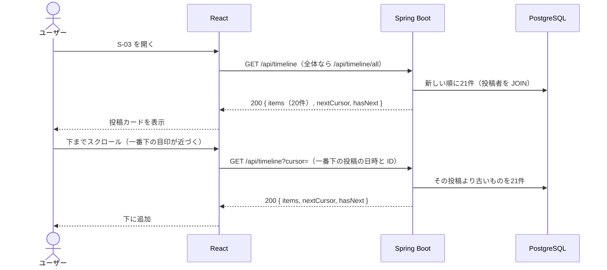
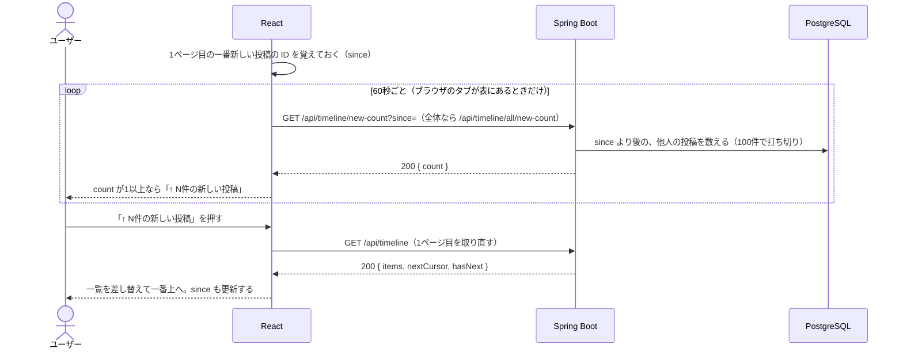

# 機能定義書：タイムライン

> **実装状況：** フォロー中・全体の2つのタブ、無限スクロール（カーソル方式）、新しい投稿のお知らせは実装済み。フォローの画面ができるまでは、フォロー中タブには自分の投稿だけが出る（follows テーブルは作成済み）。いいね数・コメント数は各機能の実装時に追加する。

## 1. 概要

投稿を新しい順に一覧表示する。「フォロー中」と「全体」の2種類があり、タブで切り替える。下までスクロールすると続きを自動で読み込み（無限スクロール）、新しい投稿があれば「↑ N件の新しい投稿」で知らせる。各投稿にはいいね数・コメント数を表示する。

| ID | 機能名 |
|---|---|
| F-20 | フォロー中タイムライン表示 |
| F-21 | 追加読み込み（無限スクロール） |
| F-22 | 全体タイムライン表示 |
| F-23 | タイムライン切り替え |
| F-24 | 新しい投稿のお知らせ |

## 2. 前提条件・権限

- ログイン済みであること
- 全体タイムラインには全ユーザーの投稿が出る（非公開アカウントの機能はない）

## 3. 画面

S-03 タイムライン（ホーム）。

| タブ | URL | 表示する投稿 |
|---|---|---|
| フォロー中（初期表示） | `/` | 自分 + フォロー中のユーザーの投稿 |
| 全体 | `/all` | 全ユーザーの投稿 |

| 状態 | 表示 |
|---|---|
| 初回の読み込み中 | 「読み込み中…」 |
| 表示中 | 投稿カードを20件。続きがあれば、一番下に近づいたとき（400px 手前）に自動で次の20件を読み込む |
| 続きの読み込み中 | 一番下に「読み込み中…」 |
| 続きがない | 一番下に「これ以上の投稿はありません」 |
| 続きの読み込みに失敗 | 一番下に「読み込みに失敗しました」と「再試行」ボタン。表示済みの投稿は消さない |
| 0件（フォロー中） | 「まだ投稿がありません。『全体』タブで気になる人を探してみましょう」（ユーザー検索の実装後は、検索へのリンクも付ける） |
| 0件（全体） | 「まだ誰も投稿していません。最初の投稿をしてみましょう」 |

- タブを切り替えると URL が変わり、そのタブの最新から読み込み直す
- 投稿カードの中身（いいね・編集・削除など）は各機能定義書を参照

### 新しい投稿のお知らせ（F-24）

| 操作・状況 | 動き |
|---|---|
| 画面を開いている間 | 60秒ごとに、前回取ってから増えた他人の投稿の件数だけを確認する（A-16 / A-17） |
| 新しい投稿があった | 一覧は動かさず、タブの下に「↑ N件の新しい投稿」を出す（99件を超えたら「99+件」）。スクロールしても見える位置に固定する |
| 「↑ N件の新しい投稿」を押した | 最新の20件を取り直し、一番上へ移動する。ボタンは消える |
| 表示中のタブ・ヘッダーの「ホーム」をもう一度押した | 同上（URL は変えない） |
| ブラウザのタブが裏にある | 確認しない。表に戻ったときにすぐ確認する |
| ほかの人が投稿を編集・削除した | 件数には数えない。取り直したときに反映される |

## 4. 入力項目とチェック

| 項目 | チェック |
|---|---|
| `cursor`（クエリパラメータ） | 前回のレスポンスの `nextCursor` をそのまま渡す。省略すると最新から。形式が違えば 400 |
| `since`（件数の確認） | 最後に1ページ目で取った一番新しい投稿の ID。必須。数字でなければ 400 |

## 5. 処理の流れ

### 一覧と無限スクロール

- 21件取得して21件目があるかで「続きあり」を判定する（件数を数える SQL を別に発行しないため）
- 続きは「一番下の投稿より古いもの」を取る（カーソル方式）。ページ番号（OFFSET）と違い、新しい投稿が先頭に増えても位置がずれないので、重複も抜けも起きない
- SQL の詳細は [データ構造・ER図「いいね数・コメント数の出し方」](../database.md#いいね数コメント数の出し方) を参照

### 新しい投稿のお知らせ

- 確認するのは件数だけ（投稿の中身は送らない）ので、通信も SQL も軽い
- 取り直す前に始まった「続きの読み込み」「件数の確認」の結果は捨てる（取り直した一覧に古い続きが付いたり、消えたボタンがまた出たりしないため）
- アクセストークンが切れていたら、他の API と同じく自動で再発行してやり直す

## 6. 業務ルール

| ルール | 内容 |
|---|---|
| 並び順 | 投稿日時の新しい順。同じ日時なら投稿IDの大きい順 |
| 件数 | 一度に20件 |
| 自分の投稿 | フォロー中タイムラインにも自分の投稿を含める |
| 表示する情報 | 投稿者のアイコン・表示名・ユーザー名、投稿日時、本文、画像、コメント数、いいね数、自分がいいね済みか、編集済みか |
| 表示しない情報 | インプレッション数、リツイート数（差別化のため） |
| 自動更新 | しない。新しい投稿は件数だけ知らせ、押されたときに取り直す（3章「新しい投稿のお知らせ」） |
| 自分が投稿したとき | 表示中のタイムラインの先頭に、その投稿を追加し、一番上へ移動する |
| 件数の確認 | 60秒ごと。自分の投稿・編集・削除は数えない |

### 設計の判断：リアルタイムに差し込まない理由

最初は、新しい投稿・編集・削除を SSE（サーバーからの常時接続の通知）でリアルタイムに反映する作りにした。しかし、利用者が多い（例えば100人）と、誰かが投稿・編集・削除するたびに画面が変わり続け、読んでいる途中で表示がずれたり次々に投稿が増えたりして読みにくい。そこで X（旧Twitter）と同じく、件数だけを定期的に知らせ、利用者が押したときだけ最新を取り直す形にした。

| 観点 | リアルタイム反映（SSE） | 定期確認＋ボタン（採用） |
|---|---|---|
| 読みやすさ | 画面が勝手に変わる | 押すまで変わらない |
| 新しい投稿に気づくまで | すぐ | 最大60秒 |
| サーバーの負担 | 画面ごとに接続を開きっぱなし。投稿のたびに全員へ送る | 60秒に1回、件数の SQL だけ |
| サーバーを複数台にするとき | 台数をまたいで通知を受け渡す仕組み（Redis など）が必要 | そのまま増やせる |

## 7. API

| ID | メソッド | パス | 備考 |
|---|---|---|---|
| A-10 | GET | `/api/timeline?cursor=` | フォロー中タイムライン |
| A-15 | GET | `/api/timeline/all?cursor=` | 全体タイムライン |
| A-16 | GET | `/api/timeline/new-count?since=` | フォロー中タイムラインの新しい投稿の件数 |
| A-17 | GET | `/api/timeline/all/new-count?since=` | 全体タイムラインの新しい投稿の件数 |

## 8. 使うテーブル

| テーブル | 使い方 |
|---|---|
| posts | R |
| users | R（投稿者） |
| follows | R（フォロー中タイムラインの絞り込み・新しい投稿の件数） |
| post_images | R |
| likes | R（件数・自分がいいね済みか） |
| comments | R（件数） |

## 9. エラー・例外時の動き

| 状況 | ステータス | 画面の表示 |
|---|---|---|
| `cursor` の形式が違う | 400 | （画面からは前回の値をそのまま渡すので通常は起きない） |
| 最初の読み込みに失敗 | 500 など | 「タイムラインを読み込めませんでした」と「再試行」ボタン |
| 続きの読み込みに失敗 | 500 など | 一番下に「読み込みに失敗しました」と「再試行」ボタン。表示済みの投稿は消さない |
| 件数の確認に失敗 | 500 など | 画面には出さない。次の確認（60秒後）でまた試す |
| 件数の確認でアクセストークンが期限切れ | 401 | 自動で再発行してやり直す。リフレッシュトークンも無効ならログイン画面へ |

## 10. 受け入れ条件

- [ ] フォロー中タブに、自分とフォロー中のユーザーの投稿だけが新しい順に出る
- [ ] 全体タブに、全ユーザーの投稿が新しい順に出る
- [ ] タブを切り替えると URL が変わり、リロードしても同じタブが出る
- [ ] 各投稿にいいね数・コメント数が正しく出る（他のユーザーがいいね・コメントした分も含む）
- [ ] 自分がいいね済みの投稿はハートが塗りつぶされている
- [ ] インプレッション数・リツイートのボタンがどこにも出ない
- [ ] 下までスクロールすると、ボタンを押さなくても次の20件が下に追加される。最後まで読むと「これ以上の投稿はありません」が出る
- [ ] 読んでいる途中で新しい投稿が増えても、同じ投稿が2回表示されず、抜けもない
- [ ] ほかの人が投稿しても、一覧は勝手に増えない（一番上を見ていても）
- [ ] 60秒以内に「↑ N件の新しい投稿」が出て、押すまで一覧も読んでいる位置も変わらない
- [ ] ボタン・表示中のタブ・ヘッダーの「ホーム」を押すと、最新を取り直して一番上へ移動する。ほかの人の編集・削除もこのとき反映される
- [ ] 自分の投稿・ほかの人の編集・削除は、件数に数えない
- [ ] フォローしていない人の新しい投稿は、フォロー中タブの件数に数えない
- [ ] 100件以上増えたら「99+件」と出る
- [ ] ブラウザのタブが裏にある間は確認せず、表に戻るとすぐ確認する
- [ ] 投稿が0件のとき、タブごとのメッセージが出る
- [ ] 20件表示するときに、投稿の件数分 SQL が発行されていない（SQL のログで確認）
