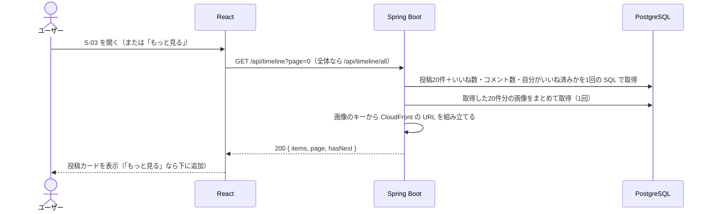

# 機能定義書：タイムライン

> **実装状況：** フォロー中・全体の2つのタブ、20件ずつの「もっと見る」は実装済み。フォローの画面ができるまでは、フォロー中タブには自分の投稿だけが出る（follows テーブルは作成済み）。いいね数・コメント数は各機能の実装時に追加する。

## 1. 概要

投稿を新しい順に一覧表示する。「フォロー中」と「全体」の2種類があり、タブで切り替える。各投稿にはいいね数・コメント数を表示する。

| ID | 機能名 |
|---|---|
| F-20 | フォロー中タイムライン表示 |
| F-21 | 追加読み込み |
| F-22 | 全体タイムライン表示 |
| F-23 | タイムライン切り替え |

## 2. 前提条件・権限

- ログイン済みであること
- 全体タイムラインには全ユーザーの投稿が出る（非公開アカウントの機能はない）

## 3. 画面

S-03 タイムライン（ホーム）。

| タブ | URL | 表示する投稿 |
|---|---|---|
| フォロー中（初期表示） | `/` | 自分 + フォロー中のユーザーの投稿 |
| 全体 | `/all` | 全ユーザーの投稿 |

| 状態 | 表示 |
|---|---|
| 初回の読み込み中 | 投稿カードの形をした灰色の枠（スケルトン）を数件表示 |
| 表示中 | 投稿カードを20件。続きがあれば一番下に「もっと見る」 |
| 「もっと見る」の読み込み中 | ボタンをローディング表示にし、押せないようにする |
| 続きがない | 「もっと見る」を消す |
| 0件（フォロー中） | 「まだ投稿がありません。『全体』タブやユーザー検索で気になる人を探してフォローしてみましょう」＋ユーザー検索へのリンク |
| 0件（全体） | 「まだ誰も投稿していません。最初の投稿をしてみましょう」 |

- タブを切り替えると URL が変わり、そのタブの1ページ目から読み込み直す
- 投稿カードの中身（いいね・編集・削除など）は各機能定義書を参照

## 4. 入力項目とチェック

| 項目 | チェック |
|---|---|
| `page`（クエリパラメータ） | 0以上の整数。省略時は 0。不正な値なら 400 |

## 5. 処理の流れ

- SQL の詳細は [データ構造・ER図「いいね数・コメント数の出し方」](../database.md#いいね数コメント数の出し方) を参照
- `hasNext` は、21件取得して21件目があるかで判定する（件数を数える SQL を別に発行しないため）

## 6. 業務ルール

| ルール | 内容 |
|---|---|
| 並び順 | 投稿日時の新しい順。同じ日時なら投稿IDの大きい順 |
| 件数 | 1ページ20件 |
| 自分の投稿 | フォロー中タイムラインにも自分の投稿を含める |
| 表示する情報 | 投稿者のアイコン・表示名・ユーザー名、投稿日時、本文、画像、コメント数、いいね数、自分がいいね済みか、編集済みか |
| 表示しない情報 | インプレッション数、リツイート数（差別化のため） |
| 自動更新 | しない。新しい投稿を見るには、タブを押し直すかリロードする |
| 自分が投稿したとき | 表示中のタイムラインの先頭に、その投稿を追加する（再読み込みはしない） |

### 「もっと見る」で投稿が重複する問題

ページ番号（OFFSET）で読み込むため、1ページ目を見ている間に新しい投稿があると、2ページ目の先頭に1ページ目で見た投稿がずれて入ってくる。
対策として、**フロントで追加するときに、すでに表示している投稿ID と同じものは取り除く**。
（根本的には「最後に表示した投稿より古いもの」を取る方式（カーソル方式）にすれば起きないが、今回は採用しない。今後の改善候補）

## 7. API

| ID | メソッド | パス | 備考 |
|---|---|---|---|
| A-10 | GET | `/api/timeline?page=0` | フォロー中タイムライン |
| A-15 | GET | `/api/timeline/all?page=0` | 全体タイムライン |

## 8. 使うテーブル

| テーブル | 使い方 |
|---|---|
| posts | R |
| users | R（投稿者） |
| follows | R（フォロー中タイムラインで、自分がフォロー中のユーザーを絞り込む） |
| post_images | R |
| likes | R（件数・自分がいいね済みか） |
| comments | R（件数） |

## 9. エラー・例外時の動き

| 状況 | ステータス | 画面の表示 |
|---|---|---|
| `page` が不正 | 400 | 1ページ目を表示し直す |
| 「もっと見る」で通信エラー | 500 など | ボタンの上に「読み込みに失敗しました」と「再試行」ボタン。表示済みの投稿は消さない |

## 10. 受け入れ条件

- [ ] フォロー中タブに、自分とフォロー中のユーザーの投稿だけが新しい順に出る
- [ ] 全体タブに、全ユーザーの投稿が新しい順に出る
- [ ] タブを切り替えると URL が変わり、リロードしても同じタブが出る
- [ ] 各投稿にいいね数・コメント数が正しく出る（他のユーザーがいいね・コメントした分も含む）
- [ ] 自分がいいね済みの投稿はハートが塗りつぶされている
- [ ] インプレッション数・リツイートのボタンがどこにも出ない
- [ ] 21件以上あると「もっと見る」が出て、次の20件が下に追加される。最後まで読むとボタンが消える
- [ ] 「もっと見る」で同じ投稿が2回表示されない
- [ ] 投稿が0件のとき、タブごとのメッセージが出る
- [ ] 20件表示するときに、投稿の件数分 SQL が発行されていない（SQL のログで確認）
