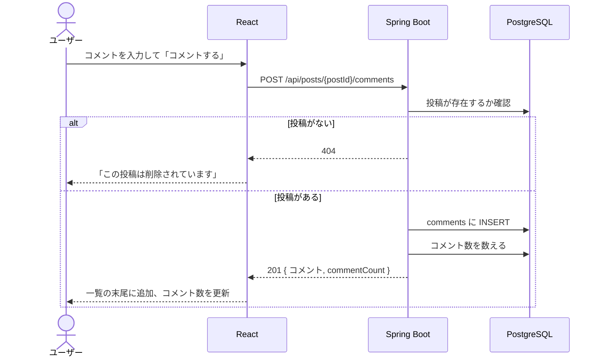

# 機能定義書：コメント

## 1. 概要

投稿にコメントを付けられるようにする。他のユーザーの投稿にも自由にコメントでき、各投稿にコメント数を表示する。

| ID | 機能名 |
|---|---|
| F-30 | コメント投稿 |
| F-31 | コメント一覧 |
| F-32 | コメント削除 |

## 2. 前提条件・権限

| 機能 | 誰ができるか |
|---|---|
| コメント投稿・一覧 | ログインユーザー全員（投稿者をフォローしていなくてもよい） |
| コメント削除 | **コメントした本人だけ**。サーバー側で必ず確認する |

- 投稿者が、自分の投稿に付いた他人のコメントを消すことはできない（今回は作らない）

## 3. 画面

S-06 投稿詳細の、投稿カードの下にコメント入力欄とコメント一覧を表示する。

| 操作 | 動き |
|---|---|
| 投稿カードの 💬 をクリック | S-06 を開き、コメント入力欄にカーソルを合わせる |
| 「コメントする」 | 成功したら入力欄を空にし、一覧の末尾に追加して、投稿カードのコメント数を API が返した値に更新する |
| コメントした人のアイコン・表示名・`@ユーザー名` をクリック | その人の S-07 プロフィールへ移動する（そこからフォローできる）。[画面仕様「ユーザーへのリンク」](../screens.md#ユーザーへのリンク共通) の共通部品を使う |
| 自分のコメントの「削除」 | 「このコメントを削除しますか？」と確認してから削除。成功したら一覧から取り除き、コメント数を1減らす |
| コメントが20件を超える | 一覧の下に「さらに表示」。押すと次の20件を追加 |
| コメントが0件 | 「まだコメントはありません」 |

- 「コメントする」ボタンは、入力が空のときと送信中は押せない
- S-06 から戻ったとき、タイムライン側のコメント数も新しい値になっているようにする（React の状態を共有するか、戻ったときに再取得する）

## 4. 入力項目とチェック

| 項目 | 必須 | チェック | エラーメッセージ |
|---|---|---|---|
| 本文 | ○ | 1〜280文字（前後の空白・改行は取り除いてから数える。数え方は投稿と同じ） | 「コメントは1〜280文字で入力してください」 |

## 5. 処理の流れ

## 6. 業務ルール

| ルール | 内容 |
|---|---|
| 表示順 | 古い順（会話の流れが追いやすいため） |
| 件数 | 1ページ20件 |
| 編集 | できない |
| 削除 | 物理削除。投稿が削除されたら、その投稿のコメントもすべて消える |
| 返信・いいね | コメントへの返信、コメントへのいいねは作らない |
| コメント数 | `comments` の行数を数えて出す（列としては持たない） |

## 7. API

| ID | メソッド | パス | 備考 |
|---|---|---|---|
| A-30 | GET | `/api/posts/{postId}/comments?cursor=` | 古い順。`items` の各要素は `{ id, content, author, createdAt, mine }` |
| A-31 | POST | `/api/posts/{postId}/comments` | 201。投稿後のコメント数 `commentCount` も返す |
| A-32 | DELETE | `/api/comments/{commentId}` | 200 で `{ commentCount }`（削除後のコメント数）を返す |

## 8. 使うテーブル

| テーブル | 投稿 | 一覧 | 削除 |
|---|---|---|---|
| comments | C・R（件数） | R | R・D・R（件数） |
| posts | R（存在確認） | R（存在確認） | |
| users | | R（コメントした人） | |

## 9. エラー・例外時の動き

| 状況 | ステータス | 画面の表示 |
|---|---|---|
| 入力チェックエラー | 400 | 入力欄の下にメッセージ |
| 投稿が削除されている | 404 | 「この投稿は削除されています」 |
| 他人のコメントを削除しようとした | 403 | 「この操作は実行できません」 |
| コメントがすでに削除されている | 404 | 一覧からそのコメントを取り除く |

## 10. 受け入れ条件

- [ ] 自分の投稿にも、他人の投稿にもコメントできる
- [ ] コメントすると、一覧の末尾に追加され、コメント数が1増える
- [ ] 他のユーザーが付けたコメントも一覧に出て、コメント数に含まれる
- [ ] 空・281文字のコメントは投稿できない
- [ ] 自分のコメントにだけ「削除」が出る。削除するとコメント数が1減る
- [ ] コメントした人の名前・アイコンをクリックすると、その人のプロフィールに移動し、フォローできる
- [ ] 他人のコメントの削除 API を直接呼ぶと 403 になる
- [ ] 投稿を削除すると、その投稿のコメントも消える
- [ ] 21件以上のコメントは「さらに表示」で読み込める
