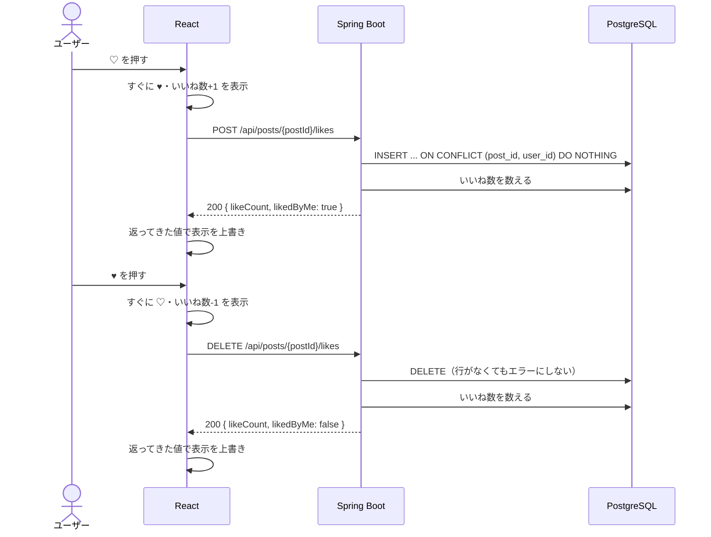

# 機能定義書：いいね

## 1. 概要

投稿にいいねを付けたり外したりできるようにする。各投稿にいいね数と、自分がいいね済みかどうかを表示する。

| ID | 機能名 |
|---|---|
| F-40 | いいね |
| F-41 | いいね取り消し |
| F-42 | いいね済み表示 |

## 2. 前提条件・権限

- ログインユーザー全員が、どの投稿にもいいねできる（自分の投稿にもできる）
- 取り消せるのは自分のいいねだけ（API がログイン中のユーザーのいいねだけを対象にするので、他人のいいねは操作できない）

## 3. 画面

投稿カード（S-03, S-06, S-07）の ♥ ボタン。

| 状態 | 表示 |
|---|---|
| いいねしていない | ♡（白抜き）＋いいね数 |
| いいね済み | ♥（赤く塗りつぶし）＋いいね数 |
| いいね数が0 | 数字を出さず、ハートだけを表示 |

| 操作 | 動き |
|---|---|
| ♡ を押す | **API の結果を待たずに**、すぐ ♥ にしていいね数を1増やす。その後 API を呼び、返ってきた `likeCount` と `likedByMe` で表示を上書きする |
| ♥ を押す | すぐ ♡ にしていいね数を1減らし、同じく API の結果で上書きする |
| API が失敗 | 押す前の表示に戻し、「いいねに失敗しました」と短く表示する |

- 画面の反応を速くするため、先に表示を変える（楽観的更新）
- API の結果で上書きするのは、その間に他のユーザーがいいねした分も反映するため
- ♥ ボタンを押しても、カードのクリック（S-06 への移動）は起きないようにする

## 4. 入力項目とチェック

入力項目なし。`postId` が存在する投稿であることをサーバーで確認する。

## 5. 処理の流れ

## 6. 業務ルール

| ルール | 内容 |
|---|---|
| 回数 | 同じ投稿へのいいねは1人1回。DB の `UNIQUE(post_id, user_id)` で保証する |
| 何度呼んでも同じ結果 | いいね済みで POST しても、いいねしていないのに DELETE しても、エラーにせず今の状態を返す。ボタンの連打や通信の再送があっても、数がずれたりエラーが出たりしない |
| いいね数 | `likes` の行数を数えて出す（列としては持たない） |
| いいねした人の一覧 | 今回は作らない（数だけ表示する） |
| 通知 | しない |
| 投稿の削除 | 投稿が消えると、その投稿へのいいねも消える |

### 連打への対策

同じボタンを素早く何度も押したときに、リクエストの順番が入れ替わって最終的な表示がずれないよう、フロントでは**1つの投稿について API の結果が返るまで次のリクエストを送らない**。送信中にもう一度押されたら、最後の状態（いいね / いいねなし）だけを覚えておき、結果が返ってから必要なら送る。

## 7. API

| ID | メソッド | パス | 備考 |
|---|---|---|---|
| A-40 | POST | `/api/posts/{postId}/likes` | 200 `{ likeCount, likedByMe }` |
| A-41 | DELETE | `/api/posts/{postId}/likes` | 200 `{ likeCount, likedByMe }` |

一覧・詳細（A-10, A-12, A-15, A-61）の Post にも `likeCount` と `likedByMe` が含まれる。

## 8. 使うテーブル

| テーブル | いいね | 取り消し |
|---|---|---|
| likes | C・R（件数） | D・R（件数） |
| posts | R（存在確認） | R（存在確認） |

## 9. エラー・例外時の動き

| 状況 | ステータス | 画面の表示 |
|---|---|---|
| 投稿が削除されている | 404 | 表示を元に戻し、「この投稿は削除されています」 |
| いいね済みで POST・いいねなしで DELETE | 200 | エラーにしない（今の状態を返す） |

## 10. 受け入れ条件

- [ ] ♡ を押すとすぐに ♥ になり、いいね数が1増える
- [ ] ♥ を押すとすぐに ♡ に戻り、いいね数が1減る
- [ ] 他のユーザーのいいねも、いいね数に含まれる
- [ ] リロードしても、いいね済みの状態といいね数が保たれる
- [ ] ボタンを連打しても、最終的な表示と DB の状態が一致する
- [ ] 同じ投稿に同じユーザーのいいねが2行以上できない
- [ ] 自分の投稿にもいいねできる
- [ ] 通信に失敗すると、押す前の表示に戻る
