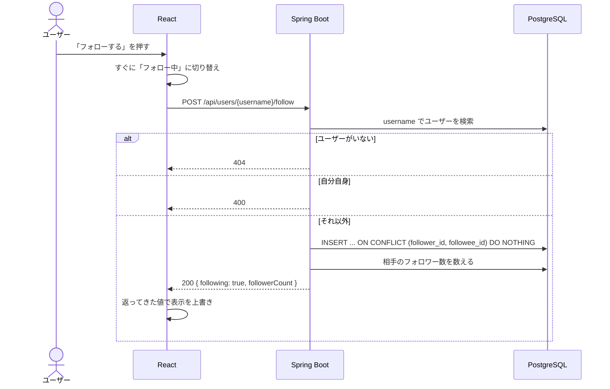

# 機能定義書：フォロー

## 1. 概要

他のユーザーをフォローし、その人の投稿をフォロー中タイムラインで見られるようにする。フォロー中・フォロワーの一覧と数を表示する。

| ID | 機能名 |
|---|---|
| F-50 | フォロー |
| F-51 | フォロー解除 |
| F-52 | フォロー中・フォロワー一覧 |

### フォローする相手の見つけ方

次の4つの経路を用意する。どの経路からでも、最後はプロフィール（S-07）か一覧の行のボタンでフォローする。

| 経路 | 使う場面 | フォローする場所 |
|---|---|---|
| ① ユーザー検索（[ユーザー検索](08_user_search.md)） | `@ユーザー名` や表示名がわかっている人を探す | S-10 の行のボタン、またはプロフィール |
| ② 投稿の投稿者 | タイムライン（フォロー中・全体）や投稿詳細で、投稿を読んで気になった人 | 投稿者名をクリック → プロフィール |
| ③ コメントした人 | 投稿詳細のコメント欄で、やり取りして気になった人 | コメントした人の名前をクリック → プロフィール |
| ④ フォロー中・フォロワー一覧 | 知り合いがフォローしている人・知り合いのフォロワーをたどる | S-09 の行のボタン、またはプロフィール |

②③の名前のクリックは、[画面仕様「ユーザーへのリンク」](../screens.md#ユーザーへのリンク共通) の共通部品で実装する。

## 2. 前提条件・権限

- ログイン済みであること
- 自分自身はフォローできない
- フォローに相手の承認はいらない（非公開アカウントの機能はない）

## 3. 画面

### フォローボタン（S-07 プロフィール、S-09 一覧、S-10 ユーザー検索で共通の部品）

| 状態 | 表示 | 押したとき |
|---|---|---|
| 自分自身 | ボタンを出さない（S-07 では「プロフィールを編集」を出す） | |
| フォローしていない | 「フォローする」（塗りつぶしのボタン） | フォローする |
| フォロー中 | 「フォロー中」（枠線だけのボタン）。マウスを乗せると赤字の「フォロー解除」に変わる | フォローを解除する（確認ダイアログは出さない） |
| 送信中 | ボタンを押せないようにする | |

- いいねと同じく、押したらすぐ表示を切り替え、API の結果で上書きする。失敗したら元に戻す
- S-07 では、API が返した `followerCount` でフォロワー数も更新する

### S-09 フォロー中・フォロワー一覧

| 項目 | 内容 |
|---|---|
| URL | `/users/:username/following`（フォロー中）、`/users/:username/followers`（フォロワー） |
| タブ | 「フォロー中」「フォロワー」で切り替え。URL も変わる |
| 並び順 | フォローした日時の新しい順 |
| 各行 | アイコン、表示名、`@ユーザー名`、自己紹介（1行まで）、フォローボタン。S-10 と同じ部品 |
| 件数 | 20件ずつ。下までスクロールすると自動で追加（無限スクロール） |
| 0件 | フォロー中: 「まだ誰もフォローしていません」／フォロワー: 「まだフォロワーはいません」 |

- フォローボタンの状態は、**一覧を見ているユーザーではなく、ログイン中の自分**がその人をフォローしているかで決まる

## 4. 入力項目とチェック

| 項目 | チェック | エラー |
|---|---|---|
| `username`（パス） | 存在するユーザーであること | 404 |
| | 自分自身ではないこと（フォロー時） | 400「自分自身はフォローできません」 |

## 5. 処理の流れ

フォロー解除は `DELETE /api/users/{username}/follow` で、行を削除する（行がなくてもエラーにしない）。

## 6. 業務ルール

| ルール | 内容 |
|---|---|
| 重複 | 同じ相手を2回フォローできない。DB の `UNIQUE(follower_id, followee_id)` で保証する |
| 自分自身 | フォローできない。アプリのチェックと DB の `CHECK(follower_id <> followee_id)` の両方で防ぐ |
| 何度呼んでも同じ結果 | フォロー済みで POST・フォローしていないのに DELETE しても、エラーにせず今の状態を返す |
| フォロー数・フォロワー数 | `follows` の行数を数えて出す（列としては持たない） |
| タイムラインへの反映 | フォローした直後から、相手の過去の投稿もフォロー中タイムラインに出る。解除したら出なくなる |
| 相手への通知 | しない |
| ブロック・ミュート | 今回は作らない |

## 7. API

| ID | メソッド | パス | 備考 |
|---|---|---|---|
| A-50 | POST | `/api/users/{username}/follow` | 200 `{ following: true, followerCount }` |
| A-51 | DELETE | `/api/users/{username}/follow` | 200 `{ following: false, followerCount }` |
| A-52 | GET | `/api/users/{username}/following?cursor=` | フォロー中一覧 |
| A-53 | GET | `/api/users/{username}/followers?cursor=` | フォロワー一覧 |

A-52 / A-53 の `items` の形は、[ユーザー検索](08_user_search.md) の A-70 と同じ。

## 8. 使うテーブル

| テーブル | フォロー・解除 | 一覧 |
|---|---|---|
| follows | C / D・R（件数） | R |
| users | R（相手の存在確認） | R |

## 9. エラー・例外時の動き

| 状況 | ステータス | 画面の表示 |
|---|---|---|
| 相手のユーザーがいない | 404 | ボタンを元に戻し、「このユーザーは見つかりません」 |
| 自分自身をフォローしようとした | 400 | 通常は画面にボタンが出ないので起きない |
| 一覧のユーザー名が存在しない | 404 | S-09 に「このアカウントは存在しません」 |

## 10. 受け入れ条件

- [ ] 他のユーザーをフォローすると、ボタンが「フォロー中」になり、相手のフォロワー数が1増える
- [ ] 投稿カードの投稿者名・コメントした人の名前をクリックしてプロフィールを開き、そこからフォローできる
- [ ] ユーザー検索で `@ユーザー名` を入れて見つけた人を、検索結果からそのままフォローできる
- [ ] フォローすると、相手の投稿がフォロー中タイムラインに出る
- [ ] フォローを解除すると、ボタンが「フォローする」に戻り、相手の投稿がフォロー中タイムラインから消える
- [ ] 自分のプロフィール・一覧の自分の行にはフォローボタンが出ない
- [ ] 自分自身をフォローする API を直接呼ぶと 400 になる
- [ ] ボタンを連打しても、同じ相手へのフォローが2行以上できない
- [ ] S-07 の「◯ フォロー中」「◯ フォロワー」の数が一覧の件数と一致する
- [ ] 一覧の各行のボタンが、ログイン中の自分から見たフォロー状態になっている
