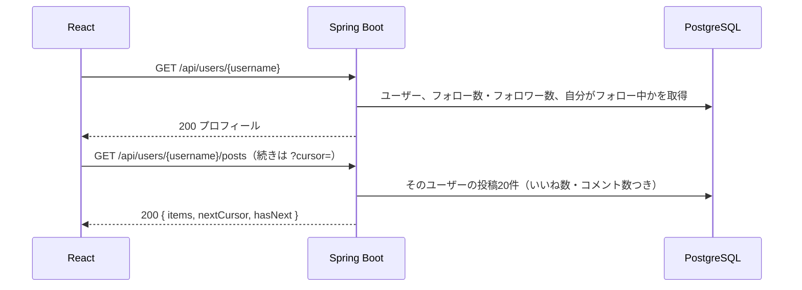
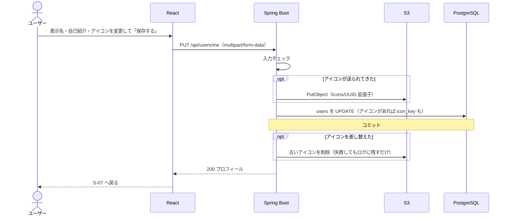

# 機能定義書：プロフィール

> **実装状況：** プロフィール表示（S-07、A-60・A-61）は実装済み。「◯ フォロー中」「◯ フォロワー」から S-09 へのリンクは一覧の実装時、「プロフィールを編集」（S-08、A-62）はプロフィール編集の実装時に追加する。アイコン画像のアップロードは画像投稿の実装時に作る（それまではアイコンは表示名の頭文字）。

## 1. 概要

ユーザーごとのページで、プロフィール情報と投稿一覧を表示する。自分のプロフィールは、表示名・自己紹介・アイコン画像を変更できる。

| ID | 機能名 |
|---|---|
| F-60 | プロフィール表示 |
| F-61 | プロフィール編集 |

## 2. 前提条件・権限

| 機能 | 誰ができるか |
|---|---|
| プロフィール表示 | ログインユーザー全員（誰のプロフィールでも見られる） |
| プロフィール編集 | 自分のプロフィールだけ（API は `/api/users/me` で、ログイン中のユーザーだけを更新する） |

## 3. 画面

### S-07 プロフィール（`/users/:username`）

| 項目 | 内容 |
|---|---|
| 上部 | アイコン（大）、表示名、`@ユーザー名`、自己紹介（改行をそのまま表示）、「◯ フォロー中」「◯ フォロワー」 |
| ボタン | 自分のとき: 「プロフィールを編集」（S-08 へ）／他人のとき: フォローボタン（[フォロー](06_follow.md)） |
| 「◯ フォロー中」「◯ フォロワー」 | クリックで S-09 へ |
| 下部 | そのユーザーの投稿一覧（新しい順に20件、下までスクロールすると自動で追加）。投稿カードは S-03 と同じ部品 |
| 投稿が0件 | 自分: 「まだ投稿がありません。最初の投稿をしてみましょう」／他人: 「まだ投稿がありません」 |
| ユーザーが存在しない | 「このアカウントは存在しません」 |

- `@ユーザー名` は URL では大文字・小文字を区別しない（`/users/Yamada` でも `yamada` のページを開く）

### S-08 プロフィール編集（`/settings/profile`）

| 操作 | 動き |
|---|---|
| 開いたとき | 今の表示名・自己紹介・アイコンが入った状態にする |
| 「アイコン画像を変更」 | ファイルを選ぶと、その場でプレビューを表示する（保存するまでは反映しない） |
| 「保存する」 | 成功したら S-07（自分）へ戻り、ヘッダーなどのアイコン・表示名も新しいものに更新する |
| 「キャンセル」 | 変更を捨てて S-07（自分）へ戻る。変更があれば「変更は保存されません。よろしいですか？」と確認 |

- 自己紹介の欄の下に「40 / 160」のように文字数を表示する
- `@ユーザー名` とメールアドレスはこの画面では変更できない

## 4. 入力項目とチェック（F-61）

| 項目 | 必須 | チェック | エラーメッセージ |
|---|---|---|---|
| 表示名 | ○ | 1〜50文字（前後の空白は取り除いてから数える） | 「表示名は1〜50文字で入力してください」 |
| 自己紹介 | | 160文字まで。空にしてもよい | 「自己紹介は160文字以内で入力してください」 |
| アイコン画像 | | jpg / png / gif、5MBまで。形式はファイルの中身で判定する | 「jpg・png・gif の画像を選択してください」「5MB以下の画像を選択してください」 |

## 5. 処理の流れ

### プロフィール表示（F-60）

2つの API は同時に呼んでよい（プロフィールの取得を待たずに投稿一覧を取りに行く）。

### プロフィール編集（F-61）

## 6. 業務ルール

| ルール | 内容 |
|---|---|
| 変更できる項目 | 表示名、自己紹介、アイコン画像 |
| 変更できない項目 | `@ユーザー名`、メールアドレス、パスワード（今回は変更機能を作らない） |
| アイコンの保存先 | S3 の `icons/{UUID}.{拡張子}`。差し替えたら古いファイルは削除する |
| アイコンの削除 | 今回は「アイコンを外してデフォルトに戻す」機能は作らない（差し替えのみ） |
| アイコンの表示 | 丸く切り抜いて表示する。画像そのものの加工（縮小・切り抜き）はしない |
| 投稿一覧 | そのユーザーの投稿だけを新しい順に。中身はタイムラインと同じ（いいね数・コメント数つき） |
| 数の表示 | フォロー数・フォロワー数は `follows` を数えて出す |

## 7. API

| ID | メソッド | パス | 備考 |
|---|---|---|---|
| A-60 | GET | `/api/users/{username}` | `followingCount`・`followerCount`・`followedByMe`・`me` を含む |
| A-61 | GET | `/api/users/{username}/posts?cursor=` | カーソル方式のページング。中身は Post |
| A-62 | PUT | `/api/users/me` | multipart。`displayName`・`bio`・`icon`（任意） |

## 8. 使うテーブル

| テーブル | 表示 | 編集 |
|---|---|---|
| users | R | R・U |
| follows | R（件数・自分がフォロー中か） | |
| posts・post_images・likes・comments | R（投稿一覧） | |

S3 は、編集でアイコンを差し替えたときにアップロードと古いファイルの削除を行う。

## 9. エラー・例外時の動き

| 状況 | ステータス | 画面の表示 |
|---|---|---|
| ユーザーが存在しない | 404 | 「このアカウントは存在しません」 |
| 入力チェックエラー | 400 | 各入力欄の下にメッセージ。入力内容は残す |
| アイコンのアップロードに失敗 | 500 | 「画像のアップロードに失敗しました」。表示名・自己紹介も更新しない |

## 10. 受け入れ条件

- [ ] 自分・他人のプロフィールで、表示名・ユーザー名・自己紹介・アイコン・フォロー数・フォロワー数・投稿一覧が出る
- [ ] 自分のプロフィールには「プロフィールを編集」、他人のプロフィールにはフォローボタンが出る
- [ ] 表示名・自己紹介を変更すると、プロフィールと過去の投稿カードの表示名が新しくなる
- [ ] アイコンを変更すると、新しいアイコンが表示され、S3 から古いアイコンが消える
- [ ] 表示名を空・51文字にすると保存できない
- [ ] 他人のプロフィールを更新する方法がない（`/api/users/me` はログイン中のユーザーだけを更新する）
- [ ] `/users/存在しない名前` を開くと「このアカウントは存在しません」と出る
- [ ] `/users/Yamada` と `/users/yamada` で同じページが出る
