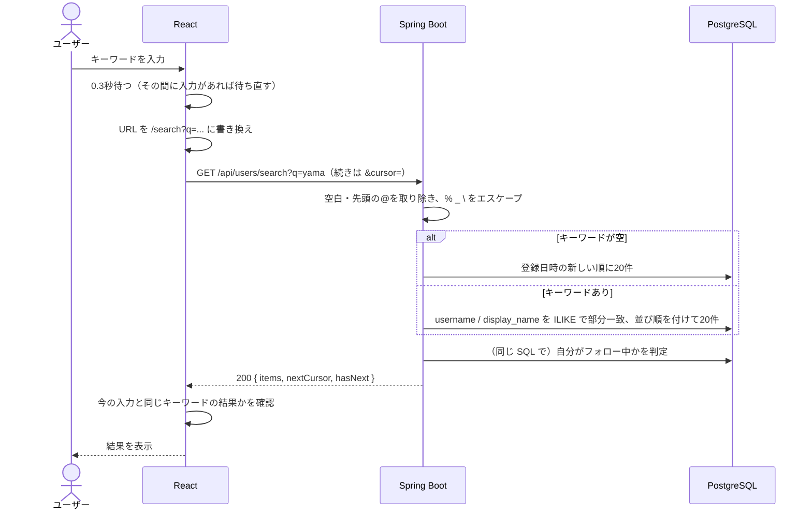

# 機能定義書：ユーザー検索

## 1. 概要

フォローする相手を見つけるために、キーワードでユーザーを探せるようにする。検索結果からそのままフォローできる。

| ID | 機能名 |
|---|---|
| F-70 | ユーザー検索 |
| F-71 | 新しいユーザー一覧（キーワードが空のとき） |

### フォローする相手の見つけ方（全体像）

| 経路 | 使う場面 |
|---|---|
| ① ユーザー検索（この機能） | `@ユーザー名` や表示名がわかっている人を探す |
| ② 投稿の投稿者 | タイムライン・投稿詳細で投稿者名をクリック → プロフィールからフォロー |
| ③ コメントした人 | 投稿詳細でコメントした人の名前をクリック → プロフィールからフォロー |
| ④ フォロー中・フォロワー一覧 | 知り合いがフォローしている人をたどる |

詳しくは [フォローの機能定義書](06_follow.md#フォローする相手の見つけ方) を参照。

### ユーザー名での検索

`@ユーザー名` を知っていれば、そのまま入力して検索できる。

| 入力 | 結果 |
|---|---|
| `@yamada` または `yamada` | ユーザー名が `yamada` の人が**一番上**に出る（完全一致を最優先） |
| `yama` | `@yamada`・`@yama_dev` など、ユーザー名が `yama` で始まる人が先に出て、その後に表示名や途中に `yama` を含む人が出る |
| `Yamada` | 大文字・小文字は区別しないので、`yamada` と同じ結果 |

## 2. 前提条件・権限

- ログイン済みであること
- 検索対象はユーザーだけ（投稿は検索しない）

## 3. 画面

### 入口

| 入口 | 動き |
|---|---|
| 共通ヘッダーの検索ボックス | 入力して Enter で `/search?q=キーワード` を開く。空のまま押すと `/search`（新しいユーザー一覧） |
| フォロー中タイムラインが0件のときのリンク | `/search` を開く |

### S-10 ユーザー検索（`/search?q=キーワード`）

| 項目 | 内容 |
|---|---|
| 検索ボックス | 最大50文字。入力が止まってから 0.3秒後に自動で検索する（Enter ならすぐ）。× で入力をクリア |
| URL | 検索するたびに `?q=` を書き換える（履歴を増やさない `replace` で）。リロードや URL の共有で同じ結果が出る |
| 見出し | キーワードあり: 「『◯◯』の検索結果」／キーワードなし: 「最近参加したユーザー」 |
| 結果の各行 | アイコン、表示名、`@ユーザー名`、自己紹介（1行まで、長ければ「…」）、フォローボタン（S-09 と同じ部品） |
| 行のクリック | そのユーザーの S-07 へ |
| 追加読み込み | 下までスクロールすると次の20件を自動で追加（無限スクロール） |
| 検索中 | 結果欄にローディング表示 |
| 0件 | 「『◯◯』に一致するユーザーは見つかりませんでした」 |

- キーワードの一部を太字にする（ハイライト）などの装飾は今回はしない

## 4. 入力項目とチェック

| 項目 | チェック | 動き |
|---|---|---|
| キーワード `q` | 前後の空白を取り除く | |
| | 先頭の `@` を1つ取り除く | `@yama` は `yama` と同じ結果 |
| | 50文字まで | フロントは入力欄で51文字目を入れられないようにする。サーバーは 400 |
| | 取り除いた結果が空 | 「最近参加したユーザー」を返す（F-71） |
| `page` | 0以上の整数 | 不正なら 400 |

## 5. 処理の流れ



- SQL の詳細は [データ構造・ER図「ユーザー検索の SQL」](../database.md#ユーザー検索の-sql) を参照

### 古い結果で上書きしない

「yam」の検索結果が「yama」の検索結果より後に届くと、画面が古い結果で上書きされてしまう。
対策として、**結果を表示する前に、それが今の入力欄のキーワードに対する結果かを確認し、違えば捨てる**（または `AbortController` で前のリクエストを取り消す）。

## 6. 業務ルール

| ルール | 内容 |
|---|---|
| 検索する項目 | `@ユーザー名` と表示名。どちらかに含まれていればヒット（部分一致） |
| 大文字・小文字 | 区別しない（PostgreSQL の `ILIKE`） |
| ひらがな・カタカナ、全角・半角 | 区別する（`やまだ` で `ヤマダ` はヒットしない）。今回はそろえない |
| 並び順 | ① ユーザー名が完全一致 → ② ユーザー名が前方一致 → ③ それ以外。同じ順位の中ではユーザー名の昇順 |
| キーワードが空 | 登録日時の新しい順（最近参加したユーザー） |
| 自分自身 | 結果に含める。フォローボタンは出さない |
| 件数 | 1ページ20件 |
| 特殊文字 | `%` `_` `\` はエスケープし、普通の文字として検索する |
| 検索履歴 | 保存しない |

## 7. API

| ID | メソッド | パス | 備考 |
|---|---|---|---|
| A-70 | GET | `/api/users/search?q=yama&cursor=` | 200 `{ items, nextCursor, hasNext }`。0件でも 200 |

`items` の各要素:

```json
{
  "id": 1,
  "username": "yamada",
  "displayName": "山田太郎",
  "bio": "Javaを勉強中の受講生です。",
  "iconUrl": "https://dxxxxxxxx.cloudfront.net/icons/8c1d...png",
  "followedByMe": true,
  "me": false
}
```

## 8. 使うテーブル

| テーブル | 使い方 |
|---|---|
| users | R（検索） |
| follows | R（自分がフォロー中か） |

インデックス: 部分一致を速くする pg_trgm の GIN インデックスは、ユーザーが増えてから追加する（[データ構造・ER図「インデックス」](../database.md#インデックス)）。

## 9. エラー・例外時の動き

| 状況 | ステータス | 画面の表示 |
|---|---|---|
| キーワードが51文字以上 | 400 | 通常は入力欄で止めるので起きない |
| 0件 | 200 | 「『◯◯』に一致するユーザーは見つかりませんでした」 |
| 通信エラー | 500 など | 結果欄に「検索に失敗しました」と「再試行」ボタン |

## 10. 受け入れ条件

- [ ] ユーザー名の一部で検索できる（`yama` で `@yamada` がヒット）
- [ ] 表示名の一部で検索できる（`太郎` で「山田太郎」がヒット）
- [ ] 大文字・小文字を区別しない（`YAMA` で `@yamada` がヒット）
- [ ] `@yama` で `yama` と同じ結果になる
- [ ] ユーザー名が完全一致する人が一番上に出る
- [ ] `_` や `%` を入れても、その文字を含むユーザーだけがヒットする
- [ ] キーワードが空のとき、最近参加したユーザーが新しい順に出る
- [ ] 検索結果からそのままフォロー・フォロー解除できる
- [ ] 自分の行にはフォローボタンが出ない
- [ ] 速く入力しても、最後に入力したキーワードの結果が表示される
- [ ] 1文字入力するたびにリクエストが飛ばない（0.3秒待ってから検索する）
- [ ] 検索後にリロードしても、同じキーワードの結果が出る
