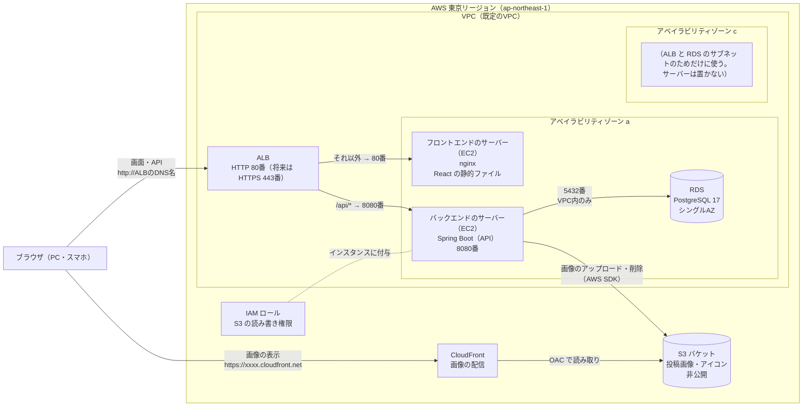

# インフラ構成：AWSデプロイ（暫定案）

[要件定義書](./requirements.md) の詳細ドキュメント。アプリを AWS 上に構築する場合の構成と運用の考え方をまとめる。

> **ステータス: 暫定案**
> 画像の保存先に S3 を使うことは決定済み。アプリのサーバーを AWS 上に構築するかは未定で、構築する場合は **EC2 + RDS + ALB** を使う前提で、先に構成をまとめておく。

構成は、前回の本棚アプリ（`bookshelf-app`）の AWS 構成をもとにした。フロントエンドとバックエンドを別々のサーバーに分ける点は同じで、前にロードバランサー（ALB）を置く点が違う。

## 全体構成

### リクエストの流れ

| リクエスト | 流れ |
|---|---|
| 画面（`/`, `/users/yamada` など） | ブラウザ → ALB → フロントエンドのサーバー（nginx が `index.html` と JS・CSS を返す） |
| API（`/api/...`） | ブラウザ → ALB → バックエンドのサーバー（Spring Boot）→ RDS |
| 画像のアップロード | ブラウザ → ALB → Spring Boot → S3（ブラウザから S3 へ直接は送らない） |
| 画像の表示 | ブラウザ → CloudFront → S3（アプリのサーバーは通らない） |

- 画面と API を **ALB のパスで振り分ける**（`/api/*` はバックエンド、それ以外はフロントエンド）。ブラウザからは1つのドメインに見えるため、CORS の設定はいらない
  - 本棚アプリでは nginx が `/api` をバックエンドへ中継していたが、今回はその役割を ALB が受け持つ
- React はページごとの URL（`/users/yamada` など）を画面側で扱うため、nginx は存在しないパスにも `index.html` を返す（`try_files $uri /index.html;`）

## 構成要素

| 要素 | 方針 |
|---|---|
| リージョン | 東京（ap-northeast-1） |
| ネットワーク | 既定の VPC とそのサブネットを使う（本棚アプリと同じ）。ALB と RDS はどちらも**2つ以上のアベイラビリティゾーンのサブネットを指定する必要がある**ため、a と c のサブネットを指定する |
| ロードバランサー | ALB（Application Load Balancer）。リスナーは HTTP 80番。パスで2つのターゲットグループに振り分ける |
| フロントエンドのサーバー | EC2（Amazon Linux 2023、t3.micro）1台。nginx で React（Vite）のビルド結果（`dist/`）を返す |
| バックエンドのサーバー | EC2（Amazon Linux 2023、t3.micro）1台。Spring Boot の jar を Java 25（Amazon Corretto 25）で動かす（systemd のサービスとして常駐） |
| データベース | RDS for PostgreSQL 17（db.t3.micro、20GB、シングルAZ）。`publicly_accessible = false` でインターネットに公開しない |
| 画像の保存 | S3 バケット1つ。パブリックアクセスはすべてブロックする。フォルダ（プレフィックス）を `posts/` と `icons/` に分ける |
| 画像の配信 | CloudFront。OAC（Origin Access Control）で、CloudFront からだけ S3 を読めるようにする |
| S3 へのアクセス権限 | バックエンドの EC2 に IAM ロール（インスタンスプロファイル）を付ける。**アクセスキーをサーバーに置かない** |
| 構築方法 | Terraform（`infra/` 配下）。本棚アプリと同じく、構成の正確な内容はコードを正とする |

### ALB のターゲットグループ

| ターゲットグループ | 振り分けるパス | 転送先 | ヘルスチェック |
|---|---|---|---|
| frontend | 既定（下記以外すべて） | フロントエンドの EC2 の 80番 | `GET /` が 200 |
| backend | `/api/*` | バックエンドの EC2 の 8080番 | `GET /api/health` が 200（Spring Boot Actuator の health を `/api/health` で公開する） |

### セキュリティグループ

送信元は IP アドレスではなく、できるだけセキュリティグループ単位で絞る（本棚アプリと同じ方針）。

| 対象 | 受け付ける接続 |
|---|---|
| ALB | HTTP（80番）：誰からでも。将来 HTTPS にしたら 443番も誰からでも |
| フロントエンドのサーバー | HTTP（80番）：**ALB のセキュリティグループからだけ**。SSH（22番）：自分のPCのIPからだけ |
| バックエンドのサーバー | 8080番：**ALB のセキュリティグループからだけ**。SSH（22番）：自分のPCのIPからだけ |
| RDS | PostgreSQL（5432番）：バックエンドのサーバーのセキュリティグループからだけ |

- EC2 は既定の VPC のパブリックサブネットに置く（プライベートサブネットに置くと、OS の更新などのために NAT ゲートウェイが必要になり、費用がかかるため）。その代わり、セキュリティグループで ALB 以外からの HTTP を受け付けない
- S3 と CloudFront はセキュリティグループではなく、IAM ロールとバケットポリシーで守る

### S3 バケットポリシーと IAM ロール

| 誰が | できること |
|---|---|
| バックエンドの EC2（IAM ロール） | `s3:PutObject`・`s3:DeleteObject`（アップロードと削除）。対象はこのバケットだけ |
| CloudFront（OAC） | `s3:GetObject`（読み取りだけ） |
| それ以外（インターネット） | 何もできない |

## 本番用の設定

Spring Boot の `application-production.yml` で、次の値を環境変数から受け取る。

| 役割 | 環境変数（例） | 内容 |
|---|---|---|
| DB の接続先 | `DB_HOST`・`POSTGRES_PORT`・`POSTGRES_DB`・`POSTGRES_USER`・`POSTGRES_PASSWORD` | RDS のエンドポイントと認証情報（ローカルの `.env` と同じ名前） |
| JWT の署名鍵 | `JWT_SECRET` | サーバー上でだけ作る。リポジトリには入れない |
| S3 | `S3_BUCKET`・`AWS_REGION` | バケット名とリージョン。アクセスキーは IAM ロールから自動で取得されるため設定しない |
| 画像の配信元 | `IMAGE_BASE_URL` | CloudFront の URL（例: `https://dxxxxxxxx.cloudfront.net`） |
| アップロードサイズ | `spring.servlet.multipart.max-file-size` など | 1枚5MB・1回のリクエストで合計20MB（4枚）まで |

- 環境変数は、バックエンドのサーバーの `/opt/sns-app/backend.env`（権限 600）に置き、systemd のサービスから読み込む（本棚アプリと同じ方式）
- フロントエンドは API を同じドメインの `/api` で呼ぶので、API の URL をビルド時に埋め込む必要がない

## 開発環境との対応

ローカルの開発環境は Docker Compose で AWS の各サービスを置き換える。

| 本番（AWS） | 開発環境（ローカル） |
|---|---|
| ALB（パスの振り分け） | Vite の開発サーバーのプロキシ（`/api` を `localhost:8080` に中継） |
| フロントエンドの EC2 | Vite の開発サーバー（`localhost:5173`） |
| バックエンドの EC2 | Spring Boot（`localhost:8080`） |
| RDS for PostgreSQL | PostgreSQL 17 のコンテナ（`postgres:17`） |
| S3 | LocalStack のコンテナ |
| CloudFront | なし（LocalStack の S3 の URL から直接表示する） |

## 費用

本棚アプリでは無料利用枠に収めることを最優先にし、ロードバランサーは使わなかった。今回は ALB を入れるため、**無料利用枠だけには収まらない**点に注意する。

| 項目 | 無料利用枠 | 今回の使い方 |
|---|---|---|
| EC2 | 月750時間（すべてのインスタンスの合計） | 2台あるため、1日あたり2台で合計24時間まで。使わないときは止める |
| 公開IPv4 | 月750時間 | EC2 と同じ時間だけ使う。ALB にも公開IPv4 が付き、その分は課金される |
| RDS | 月750時間・20GB | 1日中動かしても収まる。自動バックアップは取らない |
| **ALB** | アカウント作成から12か月は月750時間の無料枠あり。それ以降は**止める機能がない**ため、存在しているだけで時間課金される（月に数千円程度） | 使う期間だけ作り、使わない期間は `terraform destroy` で ALB ごと削除する |
| S3 | 5GB（12か月） | 学習用の画像なら収まる |
| CloudFront | 月1TBの転送（常時無料） | 収まる |

- 料金の目安は変わることがあるので、構築前に AWS の料金ページで確認する
- 請求アラート（AWS Budgets）を先に設定しておく

## デプロイ・運用の考え方

前回・前々回と同じく、EC2 はメモリが少ないため、**ビルドはすべてローカルで行い、成果物だけを配置する**（EC2 上ではビルドしない）。

- バックエンド: `./gradlew bootJar` で作った jar を、バックエンドの EC2 に置いて systemd で再起動する
- フロントエンド: `npm run build` で作った `dist/` を、フロントエンドの EC2 の nginx の公開フォルダに置く
- DB のテーブルは、Spring Boot の起動時に Flyway が作成・更新する
- これらは `infra/deploy.sh` にまとめる。EC2 の起動・停止は `infra/servers.sh`（本棚アプリと同じ使い方）
- ALB は止められないため、使わない期間は `terraform destroy` で環境ごと削除する（RDS のデータも消えるので、残したい場合はスナップショットを取る）

## 今後の課題（未対応）

| 項目 | 内容 |
|---|---|
| AWS 上に構築するか | 未定。構築しない場合も、S3（と CloudFront）だけは使う |
| **HTTPS 化** | 本アプリはログインがあり、パスワードと JWT を送るため、**インターネットに公開するなら HTTPS は必須**。独自ドメインを取得し、ACM（無料の証明書）を ALB に付けて 443番で受ける。HTTP の 80番は 443番へリダイレクトする |
| 冗長化 | 今は各サーバー1台・RDS はシングルAZ。必要になったら EC2 をアベイラビリティゾーン c にも置き、RDS をマルチAZにする（ALB があるので、EC2 を増やすのは簡単） |
| Terraform の state | ローカル保存からリモート（S3）保存への移行 |
