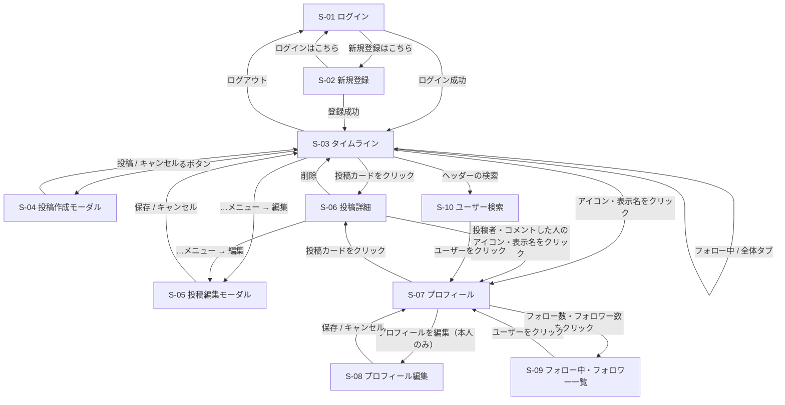

# 画面仕様・画面遷移・ユースケース

[要件定義書](./requirements.md) の詳細ドキュメント。X風SNSアプリの画面設計をまとめる。

## 画面仕様

### 画面一覧

| ID | 画面名 | URL（React のルート） | ログイン要否 | 主な機能 |
|---|---|---|---|---|
| S-01 | ログイン | `/login` | 不要 | F-02 |
| S-02 | 新規登録 | `/signup` | 不要 | F-01 |
| S-03 | タイムライン（ホーム） | `/`（フォロー中）<br>`/all`（全体） | 必要 | F-20, F-22, F-23, F-21, F-24, F-12, F-40, F-41 |
| S-04 | 投稿作成（モーダル） | S-03 の上に表示 | 必要 | F-10 |
| S-05 | 投稿編集（モーダル） | 表示元の画面の上に表示 | 必要 | F-11 |
| S-06 | 投稿詳細 | `/posts/:postId` | 必要 | F-13, F-30, F-31, F-32, F-40, F-41, F-12 |
| S-07 | プロフィール | `/users/:username` | 必要 | F-60, F-21, F-50, F-51 |
| S-08 | プロフィール編集 | `/settings/profile` | 必要 | F-61 |
| S-09 | フォロー中・フォロワー一覧 | `/users/:username/following`<br>`/users/:username/followers` | 必要 | F-52, F-50, F-51 |
| S-10 | ユーザー検索 | `/search?q=キーワード` | 必要 | F-70, F-71, F-50, F-51 |

- ログインが必要な画面に未ログインでアクセスした場合は、S-01 ログインに移動する
- ログイン済みで S-01 / S-02 にアクセスした場合は、S-03 タイムラインに移動する

### 共通部品

#### 共通ヘッダー（ログイン後の全画面）

```
+----------------------------------------------------------+
| [ロゴ] [🔍 ユーザーを検索    ]  [ホーム] [プロフィール] [ログアウト] |
+----------------------------------------------------------+
```

- 検索ボックスに入力して Enter を押す（またはクリックする）と、S-10 ユーザー検索に移動し、入力したキーワードで検索する

#### 投稿カード

タイムライン、プロフィール、投稿詳細で共通して使う。

```
+----------------------------------------------------------+
| (icon) 山田太郎  @yamada · 3分前 · 編集済み         [ … ] |
|                                                          |
|  今日はSpring Bootの勉強をしました。                      |
|                                                          |
|  +------------+ +------------+                           |
|  |   画像1    | |   画像2    |                           |
|  +------------+ +------------+                           |
|                                                          |
|  💬 3        ♥ 12                                        |
+----------------------------------------------------------+
```

| 項目 | 内容 |
|---|---|
| アイコン・表示名・@ユーザー名 | クリックで投稿者の S-07 プロフィールへ（[ユーザーへのリンク](#ユーザーへのリンク共通)） |
| 投稿日時 | 1時間以内は「◯分前」、24時間以内は「◯時間前」、それより前は「2026/09/30」形式 |
| 編集済み | 一度でも編集された投稿にだけ表示（F-11） |
| `…` メニュー | **自分の投稿にだけ表示**。「編集」（S-05）と「削除」（F-12、確認ダイアログあり） |
| 本文 | 改行をそのまま表示する |
| 画像 | 1〜4枚。枚数に応じて並べ方を変える。クリックで拡大表示 |
| 💬 コメント数 | 投稿へのコメント数。クリックで S-06 投稿詳細へ |
| ♥ いいね数 | 投稿へのいいね数。クリックでいいね / 取り消し（F-40, F-41）。自分がいいね済みならハートを赤く塗りつぶす（F-42）。いいね数が0のときは数字を出さない。詳しくは [いいねの機能定義書](feature-specs/05_like.md) |
| カードの余白部分 | クリックで S-06 投稿詳細へ |

**置かないもの（差別化）**: リツイート・引用ボタン、インプレッション数（表示回数・📊アイコン）。

いいねボタンは、押した瞬間に画面上の数とハートの色を先に変え、API が失敗したら元に戻す（画面の反応を速く見せるため）。

#### ユーザーへのリンク（共通）

ユーザーの **アイコン・表示名・`@ユーザー名`** が表示されている場所では、どこでもクリックでその人の S-07 プロフィール（`/users/:username`）へ移動する。プロフィールからフォローできるので、気になった人をその場でフォローできる。

| 表示されている場所 | 画面 |
|---|---|
| 投稿カードの投稿者 | S-03 タイムライン（フォロー中・全体）、S-06 投稿詳細、S-07 プロフィール |
| コメントした人 | S-06 投稿詳細のコメント一覧 |
| ユーザー一覧の各行 | S-09 フォロー中・フォロワー一覧、S-10 ユーザー検索（この2画面は、行の中のボタンで直接フォローもできる） |

- 部品として1つにまとめ（例: `<UserLink>`）、すべての場所で同じものを使う
- マウスを乗せたら表示名に下線を出し、クリックできることがわかるようにする
- 投稿カードの中にあるので、クリックしても投稿詳細（S-06）への移動は起きないようにする（クリックイベントの伝わりを止める）
- 自分の名前をクリックした場合も、自分の S-07 へ移動する

### 各画面

#### S-01 ログイン

```
+--------------------------------------+
|             SNSアプリ                |
|                                      |
|  メールアドレス                       |
|  [                              ]    |
|  パスワード                           |
|  [                              ]    |
|                                      |
|  [          ログイン            ]    |
|                                      |
|  アカウントをお持ちでない方は         |
|  新規登録はこちら                     |
+--------------------------------------+
```

| 項目 | 種類 | 必須 | チェック |
|---|---|---|---|
| メールアドレス | テキスト | ○ | メール形式 |
| パスワード | パスワード | ○ | |

- 失敗時は「メールアドレスまたはパスワードが正しくありません」と表示する（どちらが違うかは教えない）

#### S-02 新規登録

```
+--------------------------------------+
|           アカウント作成              |
|                                      |
|  ユーザー名   @[                ]    |
|  表示名        [                ]    |
|  メールアドレス [                ]    |
|  パスワード    [                ]    |
|  パスワード（確認）[             ]    |
|                                      |
|  [          登録する            ]    |
|                                      |
|  ログインはこちら                     |
+--------------------------------------+
```

| 項目 | 必須 | チェック |
|---|---|---|
| ユーザー名 | ○ | 半角英数字と `_`、4〜15文字、重複不可 |
| 表示名 | ○ | 1〜50文字 |
| メールアドレス | ○ | メール形式、重複不可 |
| パスワード | ○ | 8文字以上 |
| パスワード（確認） | ○ | パスワードと一致（フロントのみでチェック） |

#### S-03 タイムライン（ホーム）

```
+----------------------------------------------------------+
| 共通ヘッダー                                              |
+----------------------------------------------------------+
| ホーム                                  [ ✏ 投稿する ]    |
|   [ フォロー中 ]  [ 全体 ]            ← タブで切り替え     |
+----------------------------------------------------------+
|              [ ↑ 3件の新しい投稿 ]  ← 新しい投稿があるとき     |
| 投稿カード                                                |
+----------------------------------------------------------+
| 投稿カード                                                |
+----------------------------------------------------------+
| ...（20件。下までスクロールすると次の20件が続く）          |
+----------------------------------------------------------+
|                     読み込み中…                           |
+----------------------------------------------------------+
```

| タブ | URL | 表示する投稿 | 機能 |
|---|---|---|---|
| フォロー中（初期表示） | `/` | 自分 + フォロー中のユーザーの投稿 | F-20 |
| 全体 | `/all` | 全ユーザーの投稿 | F-22 |

- タブで切り替える（F-23）。URL も変わるので、ブラウザの「戻る」やリロードでも同じタブが表示される
- どちらも新しい順に20件表示し、下までスクロールすると次の20件を自動で下に追加する（無限スクロール、F-21）。最後まで読むと「これ以上の投稿はありません」
- 新しい投稿のお知らせ（F-24）：60秒ごとに新しい投稿の件数だけを確認し、あれば画面の中央にモーダルで知らせ、タブの下にも「↑ N件の新しい投稿」を出す（99件を超えたら「99+件」）
  - モーダルはスクロール位置に関係なく出す。「最新の投稿を見る」で取り直し、「あとで」で閉じる（ボタンは残り、さらに増えたらまたモーダルを出す）
  - 一覧は勝手に増やさない（読んでいる途中で表示がずれたり、利用者が多いと次々に増えて読めなくなったりするのを防ぐ）
  - モーダル・ボタンを押すか、表示中のタブ・ヘッダーの「ホーム」をもう一度押すと、最新の20件を取り直して一番上へ移動する。ほかの人の編集・削除もこのとき反映される
  - ブラウザのタブが裏にある間は確認しない（表に戻ったときにすぐ確認する）
- 投稿するとどちらのタブでも自分の投稿が先頭に出る
- 投稿が0件のときのメッセージ
  - フォロー中: 「まだ投稿がありません。『全体』タブやユーザー検索で気になる人を探してフォローしてみましょう」（ユーザー検索 S-10 へのリンクつき）
  - 全体: 「まだ誰も投稿していません。最初の投稿をしてみましょう」

#### S-04 投稿作成（モーダル）

```
+------------------------------------------------+
| 新しい投稿                                  [×] |
|------------------------------------------------|
| (icon)  いまどうしてる？                        |
|         [                                    ] |
|         [                                    ] |
|                                                |
|         [画像1 ×] [画像2 ×]                    |
|------------------------------------------------|
| [🖼 画像を追加]              245 / 280 [投稿する] |
+------------------------------------------------+
```

| 項目 | チェック |
|---|---|
| 本文 | 280文字まで。残り文字数を表示し、超えたら赤字にして投稿ボタンを押せなくする |
| 画像 | 4枚まで。jpg / png / gif、1枚5MBまで。選んだ画像はプレビュー表示し、× で外せる |
| 投稿ボタン | 本文も画像も空のときは押せない |

- 投稿に成功したらモーダルを閉じ、タイムラインの先頭に新しい投稿を表示する

#### S-05 投稿編集（モーダル）

S-04 と同じ見た目。ただし次の点が違う。

- 本文には今の内容が入った状態で開く
- 画像は表示するだけで、追加・削除はできない
- ボタンの名前は「保存する」
- 保存後は投稿カードに「編集済み」が付く

#### S-06 投稿詳細

```
+----------------------------------------------------------+
| 共通ヘッダー                                              |
+----------------------------------------------------------+
| ← 戻る   投稿                                             |
+----------------------------------------------------------+
| 投稿カード（本文・画像を大きめに表示）                     |
|  💬 3        ♥ 12                                        |
+----------------------------------------------------------+
| (icon) [ コメントを書く...                 ] [コメントする] |
+----------------------------------------------------------+
| (icon) 佐藤花子 @sato · 2分前                      [削除] |
|   わかりやすいです！                                       |
+----------------------------------------------------------+
| (icon) 鈴木一郎 @suzuki · 1分前                            |
|   自分も勉強中です                                         |
+----------------------------------------------------------+
```

- コメントは古い順に表示する（F-31）
- コメントした人のアイコン・表示名・`@ユーザー名` をクリックすると、その人の S-07 プロフィールへ移動する（そこからフォローできる）
- コメント入力は1〜280文字（F-30）。投稿するとコメント一覧の末尾に追加し、コメント数を1増やす
- 自分のコメントにだけ「削除」を表示する（F-32）。削除するとコメント数を1減らす
- 投稿が削除済み・存在しない場合は「この投稿は見つかりません」と表示する

#### S-07 プロフィール

```
+----------------------------------------------------------+
| 共通ヘッダー                                              |
+----------------------------------------------------------+
|  (大きいicon)                                             |
|  山田太郎                        [プロフィールを編集]       |
|  @yamada                         または [フォローする]     |
|                                                          |
|  Javaを勉強中の受講生です。                                 |
|                                                          |
|  12 フォロー中   8 フォロワー                              |
+----------------------------------------------------------+
| 投稿                                                      |
+----------------------------------------------------------+
| 投稿カード（このユーザーの投稿のみ、新しい順に20件）       |
+----------------------------------------------------------+
|           （下までスクロールすると次の20件が続く）          |
+----------------------------------------------------------+
```

| ボタン | 表示条件 |
|---|---|
| プロフィールを編集 | 自分のプロフィールのとき（S-08 へ） |
| フォローする | 他人のプロフィールで、まだフォローしていないとき（F-50） |
| フォロー中 | 他人のプロフィールで、フォロー済みのとき。マウスを乗せると「フォロー解除」に変わり、押すと解除（F-51） |

- 「◯ フォロー中」「◯ フォロワー」をクリックすると S-09 へ
- 存在しないユーザー名のときは「このアカウントは存在しません」と表示する

#### S-08 プロフィール編集

```
+----------------------------------------------------------+
| 共通ヘッダー                                              |
+----------------------------------------------------------+
| プロフィールを編集                                         |
|                                                          |
|  (icon)  [アイコン画像を変更]                              |
|                                                          |
|  表示名                                                   |
|  [山田太郎                                          ]     |
|  自己紹介                                                 |
|  [Javaを勉強中の受講生です。                         ]     |
|  [                                                  ]     |
|                                           40 / 160       |
|                                                          |
|                       [キャンセル]  [保存する]             |
+----------------------------------------------------------+
```

| 項目 | 必須 | チェック |
|---|---|---|
| アイコン画像 | | jpg / png / gif、5MBまで |
| 表示名 | ○ | 1〜50文字 |
| 自己紹介 | | 160文字まで |

- `@ユーザー名` とメールアドレスはこの画面では変更できない（プロフィールで変更できる「名前」は表示名のみ）

#### S-09 フォロー中・フォロワー一覧

```
+----------------------------------------------------------+
| 共通ヘッダー                                              |
+----------------------------------------------------------+
| ← 山田太郎 @yamada                                        |
|   [ フォロー中 ]  [ フォロワー ]      ← タブで切り替え     |
+----------------------------------------------------------+
| (icon) 佐藤花子 @sato                        [フォロー中]  |
|        Reactが好きです                                     |
+----------------------------------------------------------+
| (icon) 鈴木一郎 @suzuki                    [フォローする]  |
|        よろしくお願いします                                 |
+----------------------------------------------------------+
```

- 各行のボタンは「ログイン中の自分」がその人をフォローしているかで切り替える（F-50, F-51）
- 自分自身の行にはボタンを表示しない
- 行をクリックするとそのユーザーの S-07 へ
- 20件ずつ表示し、下までスクロールすると自動で追加読み込み（無限スクロール）

#### S-10 ユーザー検索

```
+----------------------------------------------------------+
| 共通ヘッダー                                              |
+----------------------------------------------------------+
| ユーザーを探す                                            |
|  [🔍 yama                                         ] [×]  |
+----------------------------------------------------------+
| 「yama」の検索結果                                         |
+----------------------------------------------------------+
| (icon) 山田太郎 @yamada                      [フォロー中]  |
|        Javaを勉強中の受講生です。                           |
+----------------------------------------------------------+
| (icon) やまちゃん @yama_dev                [フォローする]  |
|        React勉強中                                        |
+----------------------------------------------------------+
| (icon) 小山花子 @hanako_k                  [フォローする]  |
|        よろしくお願いします                                 |
+----------------------------------------------------------+
|           （下までスクロールすると次の20件が続く）          |
+----------------------------------------------------------+
```

| 項目 | 内容 |
|---|---|
| 検索ボックス | 最大50文字。入力が止まってから 0.3秒後に自動で検索する（Enter でもすぐ検索）。× で入力をクリア |
| URL | 検索するたびに `/search?q=キーワード` に変える。リロード・ブラウザの「戻る」・URL の共有で同じ結果が出る |
| 見出し | キーワードあり: 「『◯◯』の検索結果」／キーワードなし: 「最近参加したユーザー」 |
| 結果の行 | アイコン、表示名、`@ユーザー名`、自己紹介（1行まで。長い場合は「…」で省略）、フォローボタン。S-09 の行と同じ部品を使う |
| フォローボタン | S-09 と同じ（未フォロー: 「フォローする」／フォロー済み: 「フォロー中」→ マウスを乗せると「フォロー解除」）。自分自身の行には出さない |
| 行のクリック | そのユーザーの S-07 プロフィールへ |
| 追加読み込み | 下までスクロールすると次の20件を自動で読み込む（無限スクロール） |

- 並び順: ユーザー名が完全一致 → ユーザー名が前方一致 → それ以外（同じ順位の中ではユーザー名の昇順）
- キーワードが空のとき: 最近登録したユーザーを新しい順に表示する（F-71）
- 0件のとき: 「『◯◯』に一致するユーザーは見つかりませんでした」と表示する
- 検索中は結果欄にローディング表示を出す。先に送ったリクエストの結果が後から届いた場合は捨てる（古い結果で上書きしないため）
## 画面遷移



共通ヘッダー（またはサイドメニュー）から、どの画面からでも「ユーザー検索（S-10）」「ホーム（S-03）」「プロフィール（自分の S-07）」「ログアウト」に移動できる。

## ユースケース／操作フロー

| ID | ユースケース | 操作フロー | 結果 |
|---|---|---|---|
| UC-01 | アカウントを作る | S-01「新規登録はこちら」→ S-02 でユーザー名・表示名・メールアドレス・パスワードを入力 →「登録する」 | ログイン状態で S-03 タイムラインが表示される |
| UC-02 | ログインする | S-01 でメールアドレス・パスワードを入力 →「ログイン」 | S-03 タイムライン（フォロー中）が表示される |
| UC-03 | ログアウトする | 共通ヘッダーの「ログアウト」 | S-01 ログインに戻る |
| UC-04 | テキスト・画像を投稿する | S-03「✏ 投稿する」→ S-04 で本文（280文字まで）を入力し、画像（4枚まで）を選択 →「投稿する」 | タイムラインの先頭に投稿が表示される |
| UC-05 | 自分の投稿を編集する | 投稿カードの `…` →「編集」→ S-05 で本文を書き換え →「保存する」 | 本文が更新され、「編集済み」が表示される |
| UC-06 | 自分の投稿を削除する | 投稿カードの `…` →「削除」→ 確認ダイアログで実行 | 投稿と、その画像・コメント・いいねが削除される |
| UC-07 | フォロー中の人の投稿を読む | S-03 を開く（「フォロー中」タブ）→ 下までスクロール | 自分とフォロー中の人の投稿が新しい順に表示され、スクロールすると続きが自動で読み込まれる |
| UC-08 | 全員の投稿を読む | S-03 の「全体」タブ | 全ユーザーの投稿が新しい順に表示される |
| UC-09 | 投稿にいいねする／取り消す | 投稿カードの ♡ をクリック（もう一度押すと取り消し） | ハートの色といいね数がすぐに切り替わる |
| UC-10 | 投稿にコメントする | 投稿カードの 💬（またはカード）をクリック → S-06 でコメントを入力 →「コメントする」 | コメント一覧の末尾に追加され、コメント数が1増える |
| UC-11 | 自分のコメントを削除する | S-06 で自分のコメントの「削除」→ 確認ダイアログで実行 | コメントが消え、コメント数が1減る |
| UC-12 | ユーザー名で人を探してフォローする | 共通ヘッダーの検索ボックスに `@ユーザー名` や表示名を入力 → S-10 の結果の行で「フォローする」 | その人をフォローし、投稿がフォロー中タイムラインに出るようになる |
| UC-13 | 投稿やコメントから人をフォローする | 投稿カードの投稿者名、または S-06 でコメントした人の名前をクリック → S-07 で「フォローする」 | その人をフォローし、フォロワー数が1増える |
| UC-14 | 知り合いのつながりから人をフォローする | S-07 の「◯ フォロー中」「◯ フォロワー」→ S-09 の行で「フォローする」 | その人をフォローする |
| UC-15 | フォローを解除する | S-07・S-09・S-10 の「フォロー中」ボタン（マウスを乗せると「フォロー解除」） | フォローが解除され、その人の投稿がフォロー中タイムラインに出なくなる |
| UC-16 | 自分のプロフィールを見る | 共通ヘッダーの「プロフィール」 | 自分の S-07（自己紹介・フォロー数・フォロワー数・投稿一覧）が表示される |
| UC-17 | プロフィールを編集する | 自分の S-07「プロフィールを編集」→ S-08 で表示名・自己紹介・アイコンを変更 →「保存する」 | プロフィールと、過去の投稿カードの表示名・アイコンが新しくなる |
| UC-18 | 再訪問時にログイン状態を保つ | ブラウザでアプリを開き直す | リフレッシュトークンが有効（最後の再発行から14日以内）なら、アクセストークンを再発行してログインしたまま S-03 が表示される。期限切れなら S-01 が表示される |
| UC-19 | 新しい投稿を読む | S-03 を開いたままにし、お知らせのモーダルが出たら「最新の投稿を見る」を押す（またはタブ・「ホーム」をもう一度押す） | リロードしなくても最新の投稿が先頭に出る。押すまでは一覧も読んでいる位置も変わらない |
